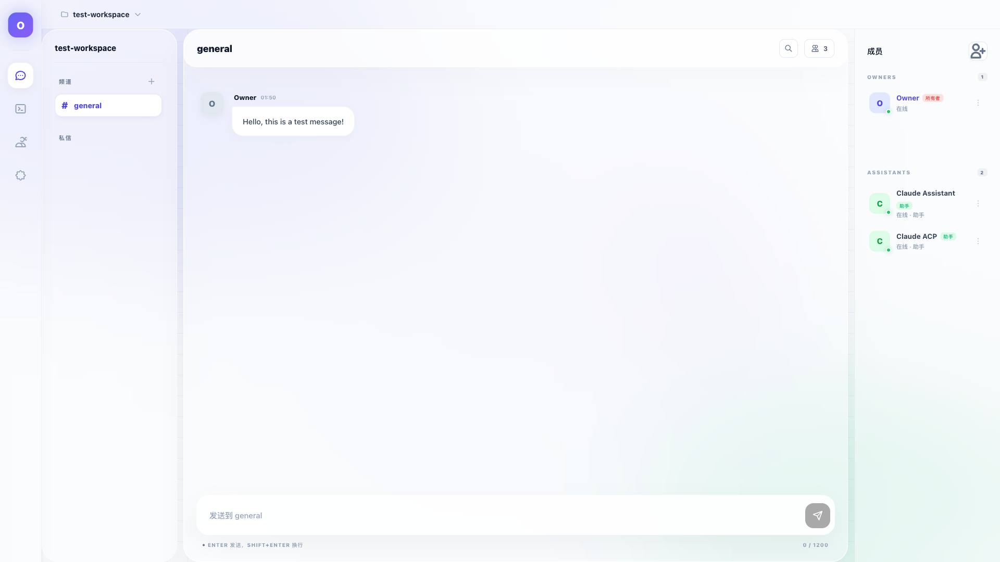
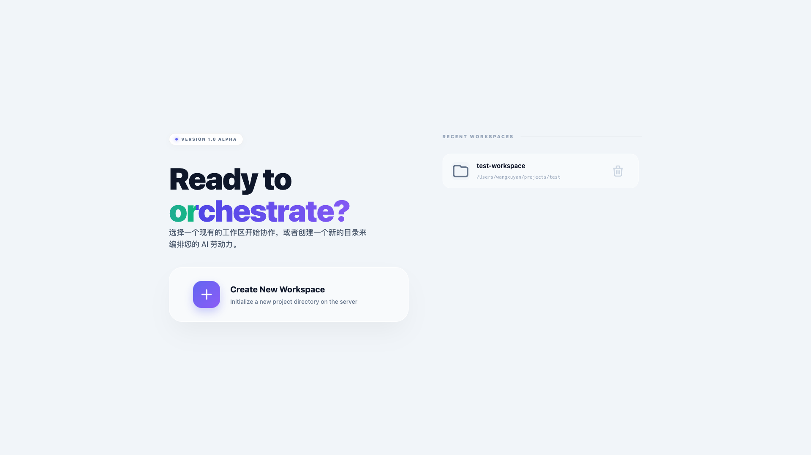
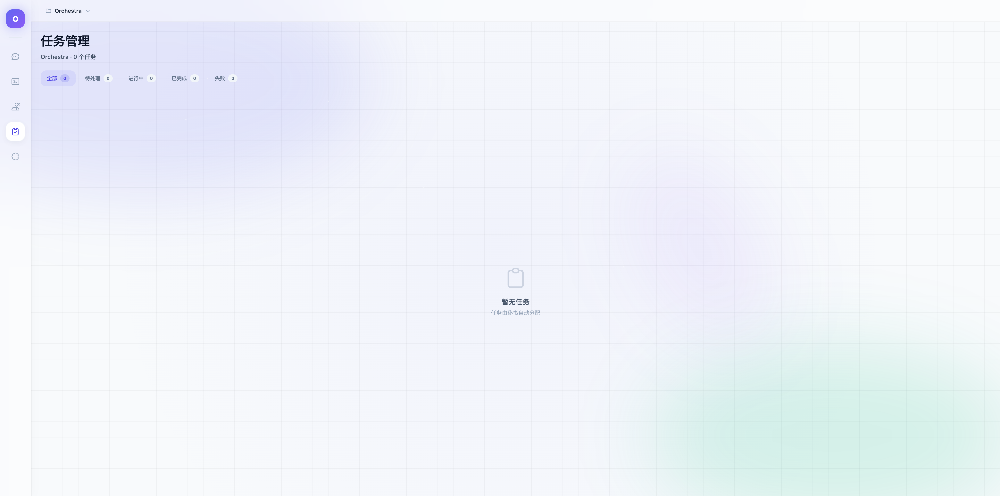
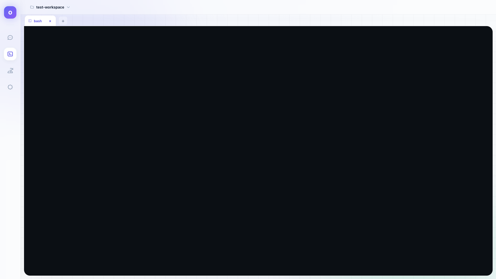
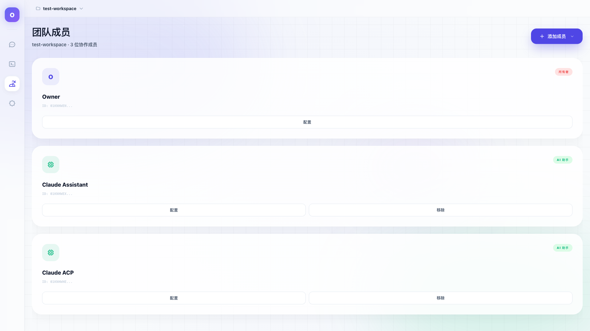
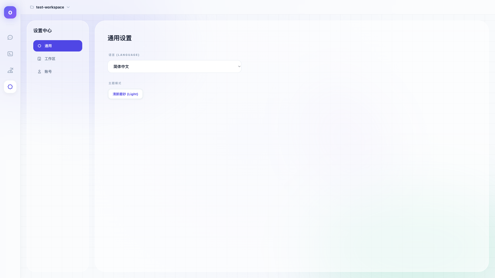
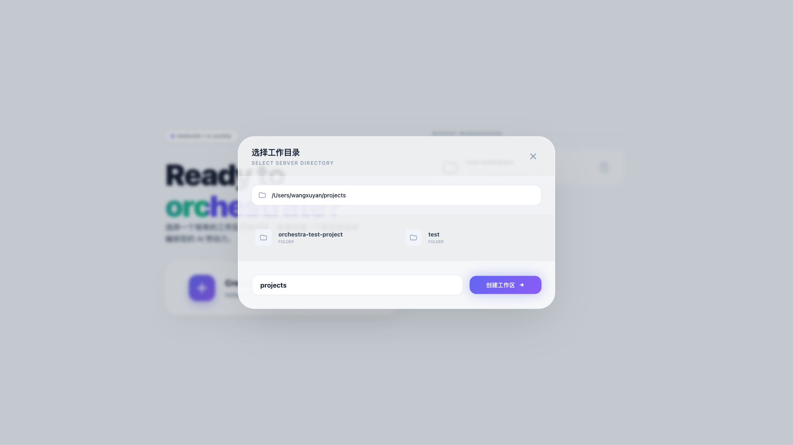

<div align="center">

# Orchestra

**A web workspace for coordinating multiple AI coding agents in parallel.**

[](#tech-stack)
[](#tech-stack)
[](#tech-stack)
[](#features)

Multi-agent collaboration platform for running Claude Code, Codex, Gemini CLI, Aider, and other coding agents side by side with chat, tasks, terminal streams, and workspace management.

[中文文档](README_CN.md)

</div>



## Product Shape

| Layer | What it does |
|---|---|
| **Workspace** | Create project-scoped workspaces and bind them to server-side paths. |
| **Members** | Manage human and AI members with roles such as Owner, Admin, Secretary, and Assistant. |
| **Agents** | Run multiple AI terminals in tmux-backed sessions that survive backend restarts. |
| **Coordination** | Route chat mentions, forward tasks, track status, and use an outbox for reliable delivery. |
| **UI** | Vue 3 dashboard with terminal streaming, Kanban-style tasks, settings, theme, and i18n. |

## Acknowledgments

The design concepts of this project were inspired by [golutra](https://github.com/golutra/golutra). Special thanks to the project and its author [seeksky](https://github.com/seekskyworld) for the inspiration. All code in this project is independently implemented.

## Features

- **Tmux-Backed Agent Sessions**: AI agent terminals run inside tmux sessions — processes survive backend restarts with automatic session recovery on startup
- **Multi-Agent Terminal Management**: Run multiple AI agent terminals in parallel, each with independent tmux sessions and PTY streams
- **ACP Support**: Structured JSON communication with AI agents for reliable message exchange
- **Provider Abstraction**: Pluggable AI provider support (Claude Code, Codex, Gemini) with unified command interface
- **Native Tool Calling**: AI agents can call Orchestra tools directly (task management, chat, status updates)
- **Task Management**: Full task lifecycle (create/start/complete/fail) with optimistic locking and Kanban view
- **Internal Chat Routing**: Secretary-to-assistant task forwarding, @mentions, and auto-forwarding of results
- **Outbox Pattern**: Reliable async message delivery with retry and dead-letter handling
- **Event Bus**: Internal pub/sub system for decoupled component communication
- **Skills System**: CLI-based skill management (install/uninstall/list) for extending AI agents
- **Real-time Collaboration Chat**: Built-in chat interface with @mentions for directing messages to specific members
- **Workspace Management**: Create and switch between multiple workspaces with configurable server-side paths
- **Member Roles**: Role-based permissions (Owner, Admin, Secretary, Assistant, Member)
- **Secretary Coordination**: Coordinator role for task distribution and multi-agent orchestration
- **Path Browser**: Browse and select server-side directories for each workspace
- **API Key Management**: Per-member API keys with encrypted storage and test endpoints
- **Modern Soft-Light Glass UI**: Clean, modern interface built with Vue 3, TypeScript, and Tailwind CSS
- **WebSocket Terminal Streaming**: Real-time terminal output via WebSocket with ANSI color support
- **Language & Theme**: English/Chinese language switching and light/dark theme toggle
- **i18n Support**: Internationalization support

## Screenshots

| Workspace | Tasks | Terminal |
|---|---|---|
|  |  |  |

| Members | Settings | Path browser |
|---|---|---|
|  |  |  |

## Tech Stack

### Backend
- **Go 1.21+** - Core runtime
- **Gin** - HTTP framework
- **gorilla/websocket** - WebSocket handling
- **SQLite** - Persistent storage
- **PTY** - Terminal emulation (via `creack/pty`)

### Frontend
- **Vue 3 + TypeScript** - UI framework
- **Pinia** - State management
- **Tailwind CSS v4** - Styling
- **xterm.js** - Terminal rendering
- **vue-i18n** - Internationalization

## Quick Start

### Prerequisites
- Go 1.21+
- Node.js 18+ (pnpm recommended)

### Backend Setup

```bash
cd backend

# Install dependencies
go mod download

# Build
make build

# Run (starts on http://localhost:8080)
make run
```

### Frontend Setup

```bash
cd frontend

# Install dependencies
pnpm install

# Development server (starts on http://localhost:5173)
pnpm dev

# Production build
pnpm build
```

### Clean Reset (for testing)

If you need to start fresh without old data:

```bash
# Stop backend first (Ctrl+C)
cd backend
make reset-data  # Deletes database and WAL files

# Optional: clear browser localStorage
# DevTools → Application → Clear site data
# Or remove keys: orchestra-settings, orchestra.auth, orchestra.user
```

### After Code Changes

Restart both dev processes after pulling changes:

1. **Backend**: Stop (`Ctrl+C`) → `make run`
2. **Frontend**: Stop (`Ctrl+C`) → `pnpm dev`

> Note: Go has no hot reload; Vite HMR may miss some edge cases.

### Security and remote deployments

Orchestra binds to `127.0.0.1:8080` by default. It is designed as a
single-administrator control plane until user-to-workspace authorization is
implemented. Do not expose it through a public address without authentication.

For a remote deployment, configure these secrets before the first start:

```bash
export ORCHESTRA_JWT_SECRET='at-least-32-random-bytes'
export ORCHESTRA_ADMIN_USERNAME='admin'
export ORCHESTRA_ADMIN_PASSWORD='a-long-unique-password'
export ORCHESTRA_ENCRYPTION_KEY='at-least-32-random-bytes'
```

`ORCHESTRA_ENCRYPTION_KEY` is required to use stored provider API keys. The
application does not fall back to a predictable development key, and self
registration remains disabled until workspace-level user authorization exists.

## Project Structure

```
Orchestra/
├── backend/              # Go backend
│   ├── cmd/              # Entry points (server, cli)
│   ├── internal/         # Internal modules
│   │   ├── a2a/          # Agent session management (pool, sessions, tools)
│   │   ├── api/          # HTTP handlers & router
│   │   ├── chatbridge/   # Terminal-to-chat bridge
│   │   ├── cli/          # CLI commands (skills, providers)
│   │   ├── config/       # Configuration loader
│   │   ├── eventbus/     # Internal pub/sub system
│   │   ├── filesystem/   # Path browser service
│   │   ├── messagequeue/ # Async message queue
│   │   ├── models/       # Data models
│   │   ├── outbox/       # Reliable async delivery (outbox pattern)
│   │   ├── persist/      # Atomic JSON saver with coalescing
│   │   ├── provider/     # AI provider abstraction (Claude, Gemini)
│   │   ├── security/     # Auth, encryption, whitelist
│   │   ├── storage/      # SQLite repository + migrations
│   │   ├── supervisor/   # Session lifecycle management
│   │   ├── tmux/         # Tmux-backed session engine (persistence + recovery)
│   │   └── ws/           # WebSocket handlers (terminal, chat)
│   ├── pkg/              # Public utilities
│   ├── configs/          # Configuration files
│   └── Makefile          # Build commands
├── frontend/             # Vue frontend
│   ├── src/
│   │   ├── app/          # App setup, router, i18n
│   │   ├── assets/       # CSS, static assets
│   │   ├── features/     # Feature modules
│   │   │   ├── auth/     # Authentication
│   │   │   ├── chat/     # Chat interface
│   │   │   ├── members/  # Member management
│   │   │   ├── settings/ # Settings page
│   │   │   ├── tasks/    # Task Kanban board
│   │   │   ├── terminal/ # Terminal workspace
│   │   │   └── workspace/# Workspace selection
│   │   └── shared/       # Shared components, API, utils, bridge
│   └── public/
├── docs/                 # Documentation
│   ├── ARCHITECTURE.md   # System architecture
│   └── superpowers/      # Specs and plans
├── CLAUDE.md             # Project instructions
├── README.md             # This file
└── README_CN.md          # Chinese documentation
```

## Member Roles

| Role | Description |
|------|-------------|
| **Owner** | Full control over workspace and members |
| **Admin** | Can manage members and workspace settings |
| **Secretary** | Coordinator role (monitoring/orchestration semantics) |
| **Assistant** | Can participate in chat and use terminals |
| **Member** | Basic participant with limited permissions |

## API Endpoints

### REST API

| Endpoint | Method | Description |
|----------|--------|-------------|
| `/health` | GET | Health check |
| `/api/workspaces` | GET | List all workspaces |
| `/api/workspaces` | POST | Create workspace |
| `/api/workspaces/:id` | GET | Get workspace details |
| `/api/workspaces/:id/members` | GET | List workspace members |
| `/api/workspaces/:id/members` | POST | Add member to workspace |
| `/api/workspaces/:id/members/:mid` | PUT | Update member |
| `/api/workspaces/:id/members/:mid` | DELETE | Remove member |
| `/api/terminals` | POST | Create terminal session |
| `/api/terminals/:id` | DELETE | Close terminal session |
| `/api/browse` | GET | Browse server paths |
| `/api/workspaces/:id/conversations` | GET/POST | List or create conversations |
| `/api/workspaces/:id/conversations/:convId/messages` | GET/POST | Read or send messages |
| `/api/workspaces/:id/tasks` | GET | List workspace tasks |
| `/api/internal/tasks/*` | POST | Agent task lifecycle callbacks |
| `/api/api-keys` | GET/POST | API key management |
| `/api/api-keys/:id` | DELETE | Remove an API key |
| `/api/api-keys/test` | POST | Test an API key |

### WebSocket

| Endpoint | Description |
|----------|-------------|
| `/ws/terminal/:sessionId` | Terminal I/O stream |
| `/ws/chat/:workspaceId` | Chat message stream |

## Configuration

Configuration file: `backend/configs/config.yaml`

Environment variables:
- `ORCHESTRA_ENCRYPTION_KEY` - API key encryption key (32+ bytes)
- `ORCHESTRA_JWT_SECRET` - enables JWT authentication
- `ORCHESTRA_ADMIN_USERNAME` / `ORCHESTRA_ADMIN_PASSWORD` - required to bootstrap the first authenticated administrator
- `ORCHESTRA_CONFIG` - Custom config file path

### Default Configuration

```yaml
server:
  http_addr: "127.0.0.1:8080"

terminal:
  max_sessions: 10
  idle_timeout: 30m

security:
  allowed_commands:
    - /bin/bash
    - /bin/zsh
    - claude        # Claude Code CLI
    - codex         # OpenAI Codex CLI
    - gemini        # Gemini CLI
    - aider         # Aider
  allowed_paths:
    - ~/projects    # Restrict path browsing
  allowed_origins:
    - "http://localhost:5173"

storage:
  database: "./data/orchestra.db"
```

### Claude Code and Codex Integration

Orchestra can run both Claude Code and Codex as tmux-backed agent terminals.

| Agent | Command | Notes |
|---|---|---|
| Claude Code | `claude` | Uses stream-json startup flags for structured terminal output. |
| Codex | `codex` | Runs in the workspace directory and can use Codex user/project configuration. |

Make sure each command appears in `security.allowed_commands`, then create an Assistant member with ACP enabled and set `acpCommand` to `claude` or `codex`. The local skills helper also detects `~/.claude/skills` and `~/.codex/skills` and can symlink Orchestra skills into both:

Command names such as `codex` allow PATH lookup only; an absolute executable path must be explicitly listed. Do not add a shell unless it is an intentional, trusted execution option.

```bash
cd backend
go run ./cmd/cli providers
go run ./cmd/cli skills install --all
```

## Development

### Code Standards
- Go: `gofmt`, `goimports`
- TypeScript: ESLint, Prettier
- Commits: Conventional Commits (`feat:`, `fix:`, `docs:`, etc.)

### Running Tests

```bash
# Backend unit tests
cd backend && make test

# Frontend unit tests
cd frontend && pnpm test

# E2E tests (starts an isolated backend automatically)
cd frontend && pnpm test:e2e

# E2E against an existing backend
ORCHESTRA_API_URL=http://your-server:8080 pnpm test:e2e
```

### Make Commands

```bash
# Backend Makefile targets
make build      # Build binary
make run        # Run server
make test       # Run tests
make reset-data # Clean database
make clean      # Remove build artifacts
```

## Roadmap

- [ ] Member presence indicators (real-time)
- [ ] Workspace templates
- [ ] Export chat transcripts
- [ ] E2E encryption for inter-agent messages

## License

MIT License

## Contributing

Contributions are welcome! Please:
1. Fork the repository
2. Create a feature branch
3. Follow code standards (gofmt, ESLint)
4. Write tests for new features
5. Submit a PR with clear description

---

Built with ❤️ for AI-assisted development workflows.
