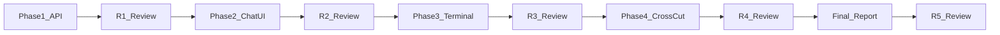

# Orchestra 后续开发计划：对照端能力对齐

**版本**: 1.0  
**日期**: 2026-03-30  
**关联文档**: [orchestra-vs-reference-parity-analysis.md](./orchestra-vs-reference-parity-analysis.md)（**v2.1**，R5 主对照 + 成员邀请/秘书增量）、[docs/gap-analysis.md](../docs/gap-analysis.md)（摘要）、[CLAUDE.md](../CLAUDE.md)（Project Charter）

**后续行动（从差距归纳的优先事项）**: [orchestra-follow-up-from-parity-gaps.md](./orchestra-follow-up-from-parity-gaps.md)

**分轮迭代**（[`功能对标流程.md`](./功能对标流程.md)）：**[轮次 01](./development-roadmap-parity-01.md)** · **[轮次 02](./development-roadmap-parity-02.md)** · **[轮次 03](./development-roadmap-parity-03.md)**（i18n 扫尾、E2E、`clientTraceId`、邀请菜单对齐、`secretary` 角色）。

---

## 1. 目标与边界

- **目标**: 在 **Web + Go 服务** 形态下，将对照端参考实现中适用于浏览器场景的能力逐项对齐；实现手段可为 HTTP/WebSocket/SSE 等，**不追求** Tauri/Rust 同名 API。
- **刻意保留（不对齐为桌面行为）**: **服务端工作区与目录切换**（Path browse、多工作区实体）— 见 Charter。
- **需求编号**: `REQ-xxx` 一条对应一个可独立验收的功能点，便于分批 PR。
- **Review**: 每阶段结束执行该阶段 **Review 检查清单**；全周期结束执行 **Final Review（R5）** 并发布 **差异分析报告 2.0**。

---

## 2. 阶段总览



| 阶段 | 主题 | Review |
|------|------|--------|
| Phase 1 | 聊天数据与 API | R1 |
| Phase 2 | chatStore 与聊天 UI | R2 |
| Phase 3 | 终端体验 | R3 |
| Phase 4 | 横切与扩展 | R4 |
| Final | 差异分析报告 2.0 + 文档同步 | R5 |

---

## 3. Phase 1 — 聊天数据与 API 对齐（R1）

对照差异报告 §3.1.1、§4.2 中 **无 / 占位** 项。

| ID | 需求摘要 | 主要落点 |
|----|----------|----------|
| REQ-101 | 会话已读：服务端持久化（per-user 或等价模型），替换 `MarkConversationRead` 占位 | `backend/internal/api/handlers/conversation.go`、`storage/repository/*`、migrations |
| REQ-102 | `chat_set_conversation_members` 等价：更新 channel 成员列表的 REST API | `backend/internal/api/router.go`、conversation repository |
| REQ-103 | 消息/会话维护：评估 `chat_repair_messages` / `chat_clear_all_messages` 等；不适用的在差异报告标 **N/A Web** | 按需 |
| REQ-104 | 未读总数与各会话未读字段与 对照端 语义一致（依赖 REQ-101 模型） | list conversations、DTO、前端展示 |

### R1 Review 检查清单

- [ ] REQ-101：刷新页面后已读状态与未读数与服务端一致。
- [ ] REQ-102：修改 channel 成员后，会话列表与消息权限符合预期。
- [ ] REQ-104：总未读、单会话未读与 对照端 行为对照说明已写在 PR 或本节附录。
- [ ] 更新或补充 E2E / 手工用例列表（路径：`frontend/e2e/` 或 dev_doc 附录）。
- [ ] 评审人 / 日期：________________

**范围 / 风险 / 备注**（R1 填写）：

```
范围：
风险：
```

---

## 4. Phase 2 — chatStore 与聊天 UI 对齐（R2）

| ID | 需求摘要 | 主要落点 |
|----|----------|----------|
| REQ-201 | `ensureDirectMessage`：与 对照端 幂等语义对齐（可包装现有 `createDirectConversation`） | `frontend/src/features/chat/chatStore.ts` |
| REQ-202 | `markAllConversationsRead` | chatStore + API |
| REQ-203 | `deleteMemberConversations` | chatStore + API（或批量删除） |
| REQ-204 | `ensureConversationLatestMessage`：替代发送后 `setTimeout` 多次刷新 | chatStore |
| REQ-205 | `refreshMessageAuthors`、`syncConversationMembers`（成员变更后会话与展示一致） | chatStore、`projectStore` / members watch |
| REQ-206 | `pendingTerminalMessages`、`readThrough` 与 `appendTerminalMessage` 与 对照端 行为差收敛 | chatStore |
| REQ-207 | UI：`MemberRow`、成员操作菜单、终端连接状态指示（最小可用集） | `features/chat/components/*`、`MembersSidebar.vue` 等 |

### R2 Review 检查清单

- [ ] 对照 [orchestra-vs-reference-parity-analysis.md §3.1.1](./orchestra-vs-reference-parity-analysis.md) 对照端 / Orchestra 方法表逐项勾选已交付项。
- [ ] UI 走查或简短录屏附在 PR 或 dev_doc。
- [ ] 评审人 / 日期：________________

**范围 / 风险 / 备注**（R2 填写）：

```
范围：
风险：
```

---

## 5. Phase 3 — 终端体验对齐（R3）

| ID | 需求摘要 | 主要落点 |
|----|----------|----------|
| REQ-301 | xterm SearchAddon + 快捷键入口 | `frontend/src/features/terminal/TerminalPane.vue` |
| REQ-302 | 重连：`terminal_attach` 等价能力（会话恢复、UI 状态） | `frontend/src/shared/socket/terminal.ts`、`terminalStore.ts`、必要时后端 |
| REQ-303 | 成员终端状态：最小 Web 替代（WS 元消息或轮询） | 协议设计与前后端 |
| REQ-304 | （可选）快照审计：默认 **延期** 或文档标明不做 | dev_doc / 差异报告 |

### R3 Review 检查清单

- [ ] 断网重连可演示；搜索可用。
- [ ] 多 tab / 分屏下行为无回归。
- [ ] 评审人 / 日期：________________

**范围 / 风险 / 备注**（R3 填写）：

```
范围：
风险：
```

---

## 6. Phase 4 — 横切与扩展能力（R4）

| ID | 需求摘要 | 说明 |
|----|----------|------|
| REQ-401 | vue-i18n 管线与关键页面文案 | 对齐 对照端 `i18n/` |
| REQ-402 | 快捷键 registry 增强（与 对照端 profiles 取舍） | `frontend/src/shared/composables/useKeyboard.ts` 等 |
| REQ-403 | Skills / PluginMarketplace | 依赖 Tauri 能力映射；可标 Web 降级或子阶段 |
| REQ-404 | 通知 / 诊断 | Web Push 或 in-app；诊断可先前端 logger |

### R4 Review 检查清单

- [ ] **不做清单**（桌面专属、不适用于 Web）已明确列出。
- [ ] 已交付项与 REQ 对应关系可追踪。
- [ ] 评审人 / 日期：________________

**范围 / 风险 / 备注**（R4 填写）：

```
范围：
风险：
```

---

## 7. Final Review（R5）— 差异分析报告 2.0

本阶段 **不实现新功能**，只做审计与文档更新。

### 7.1 步骤

1. **代码冻结窗口**：记录 Orchestra 与 对照端 对照用的 **commit 或 tag**（两仓库分别记录）。
2. **全量再审计**：按 [orchestra-vs-reference-parity-analysis.md](./orchestra-vs-reference-parity-analysis.md) 结构（§1–§5、附录）重跑文件级与方法级表格，更新「状态」列。
3. **升级** `dev_doc/orchestra-vs-reference-parity-analysis.md`：
   - 版本号 **1.0 → 2.0**（或按需 1.1）。
   - 更新 **日期**、**对照基准**（含 commit）。
   - 新增 **「修订说明」**：相对上一版已关闭的 REQ、仍存在的差距、明确 N/A Web 项。
4. **同步** [docs/gap-analysis.md](../docs/gap-analysis.md)：更新顶部摘要或删减与 v2.0 报告矛盾的表格，保留指向 `dev_doc/orchestra-vs-reference-parity-analysis.md` 的链接。

### R5 Review 检查清单

- [x] v2.0 报告与当前代码一致（以本周期实现为准）。
- [x] `gap-analysis.md` 与 v2.0 无冲突（摘要 + 指向主报告）。
- [x] 修订说明可映射到本 roadmap 的 REQ 编号。
- [ ] 评审人 / 日期：________________

---

## 8. 实施进度（随开发更新）

| 日期 | 内容 |
|------|------|
| 2026-03-30 | Phase 1：REQ-101 已读游标表 + list 未读、MarkAllRead、SetMembers、DeleteMemberConversations；REQ-102/104 已接前后端。REQ-103：`chat_clear_all` 等标 **N/A Web**。 |
| 2026-03-30 | Phase 2：REQ-201–205、203 与成员删除联动；REQ-206 **部分**（流式终端消息；无 `pendingTerminalMessages`/`readThrough` 全量）。REQ-207：`MemberRow` 终端角标 + 侧栏菜单接 `ChatInterface`。 |
| 2026-03-30 | Phase 3：REQ-301/302 已交付。**REQ-303**：`GET /api/workspaces/:id/terminal-sessions` + `terminalMemberStore` 8s 轮询 + 角标区分服务端 PTY / 本地 WS。**REQ-304**：快照审计 **延期**（见 v2.0 不做清单）。 |
| 2026-03-30 | Phase 4：REQ-401 `vue-i18n` + 设置语言联动；REQ-402 `getRegisteredShortcutsSnapshot` + 设置页合并列表 + `Ctrl+5` Skills；REQ-403 `SkillsPlaceholder` 路由；REQ-404 `diagnosticsStore` + axios 日志 + 5xx Toast。 |
| 2026-03-30 | **R5**：`orchestra-vs-reference-parity-analysis.md` 升级 **v2.0**（修订说明、commit 窗口、表格更新）；`docs/gap-analysis.md` 收敛为摘要并指向 v2.0。 |
| 2026-03-30 | **轮次 03**：i18n 扫尾、`clientTraceId`、E2E `workspaces`、`InviteMenu` + 侧栏槽位、成员角色 **`secretary`（秘书）** 与 PTY 转发；差异报告 **v2.1**。详见 [development-roadmap-parity-03.md](./development-roadmap-parity-03.md)。 |

---

## 9. 实施顺序（PR 策略）

1. 本 roadmap 合并后，**Phase 1** 起每个 REQ 或逻辑分组单独 PR 更佳。
2. **Final** 阶段单独 PR：仅包含 `orchestra-vs-reference-parity-analysis.md`（v2.0）、`gap-analysis.md` 调整及本文件「R1–R5 填写区」归档（可选）。

---

*文档结束。*
