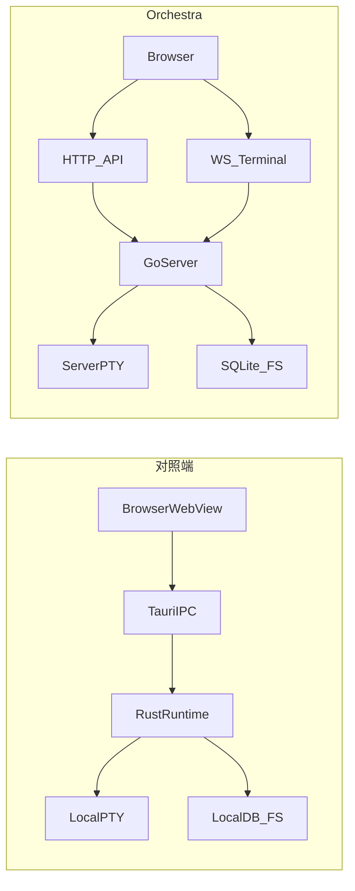

# Orchestra 与 对照端 细粒度差异分析报告

**版本**: 2.1  
**日期**: 2026-03-30  
**对照基准**:

- **Orchestra**（本仓库）commit: `94ec9c375407a9ed6f5638482a64739290331350`（R5 记录窗口；后续以你本地 `git rev-parse HEAD` 为准）。
- **对照端**: 在开发机上 checkout 的参考用桌面仓库（路径由团队约定，例如与 Orchestra 并列的独立目录）。

**粒度说明**: 「功能点」指用户可感知行为、前端 Store 对外方法、独立 Vue 页面/组件文件职责、或后端 REST/WebSocket/原生命令级能力。表格中 **状态** 含义：`有` 基本等价或已覆盖；`部分` 行为简化或仅部分对齐；`无` 未实现；`替代` 用不同技术路径实现近似目标；`N/A Web` 明确不对齐浏览器形态。

**路线图**: [development-roadmap-parity.md](./development-roadmap-parity.md) — Phase 1–4 与 R5 已在 v2.0 周期内闭环到「可交付 Web 子集」；**v2.1** 起补充成员邀请 UI 与 `secretary` 角色（见下方修订说明）；桌面专属能力见 **不做清单**。

**后续工作归纳（优先清单）**: [orchestra-follow-up-from-parity-gaps.md](./orchestra-follow-up-from-parity-gaps.md)

### 修订说明（相对 v2.0 → v2.1）

- **成员邀请入口**：`InviteMenu.vue` 已落地；`MembersSidebar` 支持 `header-action` 插槽，`ChatInterface` / `MembersPage` 使用「单图标 + 菜单」与 对照端 侧栏模式对齐（仍无 `useFriendInvites` / 好友弹窗全链路）。
- **成员角色扩展**：Orchestra 增加 `roleType: secretary`（产品文案 **秘书**，语义对齐 对照端 式 **监工/协调**）；`AddMemberModal` 对 secretary 与 assistant 共用 CLI 选型；列表分组与排序已接；后端 `forwardUserTextToAssistantPTY` 对 **assistant ∪ secretary** 转发用户输入（与 对照端 的 `MemberRole` 四元组并存为 **Web 扩展**，非桌面类型同名）。
- **仍为「部分」**：`POST .../members` 仍无 对照端 `inviteProjectMembers` 的实例数、沙箱、`unlimitedAccess` 等字段；邀请弹窗能力对比见 §3.1 表格更新行。

### 修订说明（相对 v1.0）

- **已关闭 / 升级**（对应 roadmap REQ）：已读游标与未读数（101/104）、频道成员 API（102）、chatStore 侧 `ensureDirectMessage`、`markAllConversationsRead`、`deleteMemberConversations`、`ensureConversationLatestMessage`、成员 watch 与 `refreshMessageAuthors`（201–205）、成员侧栏菜单与 `MemberRow` 终端角标（207）、终端 SearchAddon（301）、按成员 attach（`GET .../terminal-session` + 前端优先附加）（302）、服务端 PTY 列表轮询（`GET .../terminal-sessions`）（303）、vue-i18n 管线与关键文案（401）、快捷键注册表导出与设置页合并列表（402）、Skills Web 占位页与路由（403）、诊断日志 + 5xx Toast（404）。
- **仍为「部分」**：`pendingTerminalMessages` / `readThrough` 与 对照端 全量对齐（206）；未读/消息状态 **无** 全局 WS 推送，仍为方法级 `applyUnreadSync` / `applyMessageStatus`（需调用方喂事件）；终端无 Tauri 级快照审计（304 **明确延期**）；好友/通讯录/多模态聊天 modals 等未搬。
- **N/A Web**：`chat_clear_all_messages` / 全库 repair 等运维向能力；Tauri `skills_*` 原生插件加载 — Orchestra 仅为占位与后续 HTTP 插件预留说明。

---

## 1. 架构与运行时差异

| 维度 | 对照端 | Orchestra |
|------|---------|-----------|
| 载体 | Tauri 2 桌面应用（多窗口能力） | 浏览器 SPA + 独立 Go HTTP 服务 |
| 前端 ↔ 业务逻辑 | `@tauri-apps/api` `invoke` / 事件总线 | `axios` 等 HTTP 客户端 + 终端 `WebSocket` |
| 进程与 PTY | Rust `src-tauri`：`runtime/pty`、`terminal_engine/*` | Go `internal/terminal`（`pty`、`pool`、`session`） |
| 持久化 | 本地 chat DB（Rust `message_service/chat_db`）等 | SQLite（`internal/storage` + `repository/*`） |
| 文件访问 | 本机路径、工作区根目录约束 | 服务端路径校验 + `filesystem/browser` 浏览 API |

### 1.1 数据流示意

---

## 2. Orchestra 相对 对照端 的设计扩展（实现落点）

与 `CLAUDE.md` / `docs/superpowers/specs/2026-03-29-orchestra-design.md` §1.3 一致，以下为 **代码级落点**。

| 能力 | Orchestra 实现 | 对照端 侧 |
|------|----------------|------------|
| 多工作区选择与切换 | 路由 `/workspaces`、`WorkspaceSelection.vue`；`workspaceStore` | `WorkspaceSelection.vue`、窗口级工作区注册；**无**「服务端多路径 API」 |
| 服务端目录浏览 | `GET /api/workspaces/:id/browse`、`GET /api/browse`；`filesystem/browser.go` + `handlers/workspace.go` | 工作区路径为本机目录；通过 Tauri 读文件系统，**无等价 REST 浏览接口** |
| 工作区 CRUD | `handlers/workspace.go` + `repository/workspace.go` | 依赖本地注册表/最近工作区（`ui_gateway/app.rs` 等），模型不同 |
| Web 登录门槛 | `LoginPage.vue`、`authStore.ts`（本地存储占位认证） | 无独立 Web 登录流（桌面应用） |

---

## 3. 前端对照（按 feature，文件级）

### 3.1 Chat（`features/chat`）

| 对照端 路径 | Orchestra 路径 | 状态 | 说明 |
|--------------|----------------|------|------|
| `ChatInterface.vue` | `ChatInterface.vue` | 部分 | Orchestra 无 Friends 条、无终端流监听注册在 `ChatInterface` 内与 对照端 完全同构；已接 `onTerminalChatStream` → `applyTerminalChatStreamEvent` |
| `chatStore.ts` | `chatStore.ts` | 部分 | 见 **§3.1.1 方法级对照** |
| `chatBridge.ts`（Tauri 聊天 API 封装） | `shared/api/client` + 各 REST 路径 | 替代 | Orchestra 用 HTTP 替代 `invoke` |
| `chatStorage.ts` | 无独立模块 | 无 | 会话/消息以服务端为准；无本地 chat 缓存层 |
| `contactsStore.ts` / `contactsStorage.ts` | 无 | 无 | 通讯录/好友体系未搬 |
| `FriendsView.vue` / `FriendsBar.vue` | 无 | 无 | 好友视图未搬 |
| `useFriendInvites.ts` | 无 | 无 | 邀请链路未搬 |
| `data.ts` / `emoji-data.ts` / `utils.ts` | 无等价大文件 | 部分 | Emoji/静态数据等未对齐 |
| `modals/InviteAssistantModal.vue` | `members/AddMemberModal.vue`（`assistant` / `secretary` / `admin` / `member`） | 部分 | 已有 `InviteMenu` 聚合入口与 CLI 选型；仍无 对照端 级实例数/沙箱/`unlimitedAccess` 等 Tauri 字段 |
| `modals/InviteAdminModal.vue` | 同上 | 部分 | 流程简化（表单 + 权限勾选 UI，权限未落服务端模型） |
| `modals/InviteFriendsModal.vue` | 无 | 无 | |
| `modals/ManageMemberModal.vue` | `EditMemberModal.vue` | 部分 | 能力集更小 |
| `modals/RenameConversationModal.vue` | 内联于 `renameConversation` API | 替代 | 无独立弹窗组件亦可改名 |
| `modals/RoadmapModal.vue` | 无 | 无 | |
| `modals/SkillManagementModal.vue` / `SkillDetailModal.vue` | `features/skills/SkillsPlaceholder.vue` | 部分 | Web 占位 + i18n 说明；无插件市场实现 |
| `components/ChatSidebar.vue` | `ChatSidebar.vue` | 部分 | 功能子集 |
| `components/ChatHeader.vue` | `ChatHeader.vue` | 部分 | |
| `components/ChatInput.vue` | `ChatInput.vue` | 部分 | Mention 能力视实现而定 |
| `components/MessagesList.vue` | `MessagesList.vue` | 部分 | 无附件/复杂消息类型全量 |
| `components/MembersSidebar.vue` | `MembersSidebar.vue` | 部分 | 已接 `MemberRow`、`#header-action` 与 `InviteMenu`（与 对照端 槽位模式对齐）；成员动作透传 `ChatInterface` |
| `components/MemberRow.vue` | `features/members/MemberRow.vue` | 部分 | 菜单、终端角标（WS + 服务端 PTY 轮询）；无独立 `MemberStatusDots` 组件 |
| `components/MemberStatusDots.vue` | 无 | 无 | |
| `components/InviteMenu.vue` | `chat/components/InviteMenu.vue` | 部分 | 文案键对齐 对照端 `invite.menu.*`；Orchestra 增加秘书项；无 Material Symbols 依赖 |
| `types.ts` | `shared/types/chat.ts` + `features/chat/types.ts` | 部分 | DTO 字段集合更小；**成员** `MemberRole` 含 `secretary`（Orchestra 扩展，对照端 源码仍为 owner/admin/assistant/member） |

#### 3.1.1 `chatStore` 导出方法对照

| 能力 | 对照端 | Orchestra | 说明 |
|------|---------|-----------|------|
| 会话列表加载 | `loadSession`（`listConversations` invoke） | `loadSession`（HTTP GET conversations） | 等价路径不同 |
| 消息首屏 | `loadConversationMessages` | `loadConversationMessages` | `beforeId` 分页 |
| 更早消息 | `loadOlderMessages` | `loadOlderMessages` | |
| 补拉最新一条 | `ensureConversationLatestMessage` | `ensureConversationLatestMessage` | 有 |
| 发送消息 | `sendMessage` | `sendMessage`（POST + 服务端转发 PTY） | |
| 确保 DM | `ensureDirectMessage` | `ensureDirectMessage`（包装 `createDirectConversation`） | |
| 创建群聊 | `createGroupConversation` | `createConversation` | |
| 更新频道成员 | `setConversationMembers` | `setConversationMembers`（PUT members） | |
| 置顶/静音/改名/清空/删会话 | 有 | 有 | |
| 删除与某成员相关会话 | `deleteMemberConversations` | `deleteMemberConversations`（DELETE + 本地刷新） | |
| 已读单会话 | `markConversationRead` | `markConversationRead` | 服务端 `conversation_reads` 持久化 |
| 全部已读 | `markAllConversationsRead` | `markAllConversationsRead` | |
| 终端流 delta / final | Tauri 事件链 | `applyTerminalStreamMessage` / `applyTerminalStreamFinal` / `applyTerminalChatStreamEvent` | **部分** 对齐；无 `pendingTerminalMessages` / `readThrough` 全量 |
| 未读/状态事件监听 | Tauri 事件订阅 | `applyUnreadSync` / `applyMessageStatus` | **无** 全局自动订阅 |
| 成员变更同步 | `syncConversationMembers` | members watch → `refreshMessageAuthors` + `loadSession` | **部分** |
| 刷新作者展示 | `refreshMessageAuthors` | `refreshMessageAuthors` | 有 |
| 活动会话 | — | `activeConversationId`、`setActiveConversation`、`sortedConversations` | |
| 本地 `addMessage` | — | `addMessage` | |

### 3.2 Terminal（`features/terminal`）

| 对照端 路径 | Orchestra 路径 | 状态 | 说明 |
|--------------|----------------|------|------|
| `terminalBridge.ts` | `shared/socket/terminal.ts` + `terminalChatBridge.ts` | 部分 | 无 Tauri 事件全量；WS 文本帧；聊天流旁路 |
| `terminalOrchestratorStore.ts` | `terminalMemberStore.ts` + `terminalStore` 部分 | 部分 | 无 `onTerminalStreamMessage` 全量 orchestration |
| `terminalEvents.ts` | 无 | 无 | |
| `openTerminalWindow.ts` | 无（Web 单页内 tab） | 替代 | |
| `TerminalWorkspace.vue` / `TerminalPane.vue` | 同名 | 部分 | 已接 SearchAddon + Ctrl+F；浏览器剪贴板非 Tauri 插件 |
| `modals/TerminalSnapshotAuditReportModal.vue` | 无 | 无 | |
| `components/TerminalCallChainList.vue` | 无 | 无 | |
| `terminalStore.ts` | `terminalStore.ts` | 部分 | 均有 tab/分屏/连接管理；Orchestra `createConnection` 内挂 `terminal_chat_stream` 分发 |

**细项**: 查找 SearchAddon **有**；同 sessionId WS 重连 + `GET .../terminal-session` 附加 **有**；`GET .../terminal-sessions` 轮询成员 PTY **有**；快照审计 **无**（REQ-304 延期）；多终端 per member 编排仍弱于 对照端。

### 3.3 Workspace / Members / Settings / 其他页面

| 对照端 | Orchestra | 状态 | 说明 |
|---------|-----------|------|------|
| `features/WorkspaceSelection.vue` | `workspace/WorkspaceSelection.vue` + `WorkspaceMain.vue` | 部分 | 服务端工作区实体 |
| `features/workspace/workspaceStore.ts` | `workspace/workspaceStore.ts` | 部分 | API 与字段不同 |
| `features/workspace/projectStore.ts` | `workspace/projectStore.ts` | 部分 | 成员来自 REST |
| `features/Settings.vue` | `settings/Settings.vue` | 部分 | i18n、诊断、快捷键列表等 |
| `features/PluginMarketplace.vue` | 无 | 无 | Web 无等价市场 |
| `features/SkillStore.vue` | `skills/SkillsPlaceholder.vue` | 部分 | 占位 + i18n |
| `features/members/*`（若存在） | `features/members/*` | 部分 | 独立 `MembersPage` 路由 |
| `app/useWorkspaceBootstrap.ts` | `router` + `workspaceStore` watch | 替代 | |

### 3.4 横切能力

| 能力 | 对照端 | Orchestra | 状态 |
|------|---------|-----------|------|
| i18n | `i18n/locales/*`、`vue-i18n` | `src/i18n/*` + `vue-i18n`；设置语言驱动 locale；关键串已抽 keys | 部分 |
| 快捷键 | `shared/keyboard/*`（registry、profiles、controller） | `useKeyboard` + `getRegisteredShortcutsSnapshot`；`Ctrl+5` Skills；设置页合并静态与动态注册项 | 部分 |
| 右键菜单 | `shared/context-menu/*`（registry、defaults、controller） | `ContextMenuHost.vue`、`useContextMenu.ts` | 部分 |
| 诊断/监控 | `shared/monitoring/*`、`ui_gateway/monitoring.rs` | `diagnosticsStore` + Settings 诊断区；axios 拦截写日志；5xx Toast | 部分 |
| Toast | `shared/components/ToastStack.vue`、`stores/toastStore.ts` | 同名/同类 | 有 |
| 侧边导航 | `SidebarNav.vue` | `SidebarNav.vue` | 部分 |

### 3.5 Auth

| 对照端 | Orchestra |
|---------|-----------|
| 无 Web `LoginPage` 流程 | `features/auth/LoginPage.vue`、`authStore.ts`（localStorage 占位校验） |

---

## 4. 后端 / 原生层对照

### 4.1 Rust 子系统 → Go 包（职责级）

| 对照端（`src-tauri/src`） | Orchestra（`backend/internal`） | 状态 |
|----------------------------|----------------------------------|------|
| `terminal_engine/*`（emulator、semantic_worker、filters、poller、snapshot…） | `terminal/*` + `chatbridge` | 部分 | Orchestra：PTY 读 → `OutputChan` + hook；按行写消息；**无** VT 语义层与过滤配置 |
| `message_service/pipeline/*` | 无独立流水线 | 无 | 策略/节流/可靠性在 bridge 内硬编码简化 |
| `message_service/chat_db/*` | `storage/repository/message.go`、`conversation.go` | 部分 | 模型与迁移不同 |
| `orchestration/*`（outbox、batcher、dispatch） | `handlers/conversation.go` 内联转发 PTY | 替代 | 无离线 outbox |
| `ui_gateway/message.rs`（chat_* commands） | `handlers/conversation.go` + `router.go` | 部分 | REST 化 |
| `ui_gateway/terminal.rs` | `handlers/terminal.go` + `ws/terminal.go` + `terminal/pool.go` | 部分 | `GET .../terminal-session`（按成员 attach）、`GET .../terminal-sessions`（列表）；snapshot/dispatch 等仍非一一对应 |
| `ui_gateway/skills.rs`、`project_skills.rs` | 无 | 无 |
| `ui_gateway/notification.rs`、`app.rs`（通知窗口） | 无 | 无 |
| `ui_gateway/monitoring.rs` | 无 | 无 |
| `platform/*`（updater、activation） | 无 | 无 |

### 4.2 Tauri 命令（摘要）与 Orchestra API 映射

**聊天相关（`ui_gateway/message.rs`）**

| Tauri 命令 | Orchestra REST | 备注 |
|------------|----------------|------|
| `chat_list_conversations` | `GET /api/workspaces/:id/conversations` | 查询参数可能不同 |
| `chat_get_messages` | `GET .../conversations/:convId/messages` | |
| `chat_send_message` / `chat_send_message_and_dispatch` | `POST .../messages` + 服务端 `forwardUserTextToAssistantPTY` | 合并为一次 HTTP；转发目标为 **assistant ∪ secretary**（秘书为 Orchestra 扩展角色） |
| `chat_ensure_direct` | `POST .../conversations`（type dm） | |
| `chat_create_group` | `POST .../conversations`（channel） | |
| `chat_set_conversation_settings` / `chat_rename_conversation` | `PUT .../settings` 或 `PUT .../conversations/:convId` | Orchestra 路由重复需注意 |
| `chat_mark_conversation_read_latest` | `POST .../read` | 已读游标持久化 |
| `chat_mark_all_read`（若存在） | `POST .../conversations/read-all` | |
| `chat_clear_conversation` / `chat_delete_conversation` | `DELETE .../messages` / `DELETE .../conversations/:convId` | |
| `chat_set_conversation_members` | `PUT .../conversations/:convId/members` | |
| `chat_ulid_new` / `chat_repair_messages` / `chat_clear_all_messages` | **无 / N/A Web** | 运维向 |
| 按成员删相关会话 | `DELETE .../members/:memberId/conversations` | Orchestra 扩展 |

**终端相关（`ui_gateway/terminal.rs`）**

| Tauri 命令 | Orchestra | 备注 |
|------------|-----------|------|
| `terminal_create` | `POST /api/terminals` | |
| `terminal_write` / `terminal_resize` / `terminal_close` | WS `input` / `resize` / `close` | |
| `terminal_attach` | `GET .../members/:memberId/terminal-session` + WS 同 id 连接 | **部分** 等价 |
| `terminal_ack` / `terminal_dispatch` | 聊天 POST 路径内联 | |
| `terminal_snapshot_*` / `terminal_dump_snapshot_lines` | **无** | REQ-304 延期 |
| `terminal_list_environments` | **无** | |
| `terminal_emit_status` / `terminal_set_member_status` | `GET .../terminal-sessions` 轮询 + 成员行角标 | **部分** Web 替代 |

**其他（仅列类别）**: `skills_*`、`project_skills_*`、`notification_*`、`diagnostics_*`、`platform_*`、应用窗口/头像/JSON 文件等 — Orchestra **大多无** 或 **不适用 Web**。

**Orchestra 独有 REST**（对照端 无同名）: `GET .../browse`、`GET /api/browse`；工作区 CRUD；`GET .../terminal-sessions`；`DELETE .../members/:memberId/conversations` 等 — 见 [`router.go`](../backend/internal/api/router.go)。

---

## 5. 数据与契约差异（要点）

| 主题 | 对照端 | Orchestra |
|------|---------|-----------|
| 终端写回消息的 `is_ai` | `chat_append_terminal_message` 持久化为 `false`，发送方为成员 | `chatbridge` 持久化同为 **`IsAI: false`**（与 对照端 对齐后） |
| 终端流事件 | Tauri `terminal-message-stream` + `TerminalMessagePayload` | WS 消息 `type: terminal_chat_stream`，payload 字段对齐子集（`mode` delta/final、`spanId`、`seq` 等） |
| 用户消息发送 | 带 `workspacePath`、`clientTraceId`、`mentions` 等 | HTTP body 含 `conversationType`、`mentions`、`clientTraceId`（可选，服务端接受暂不持久化）等；**无** `workspacePath`（cwd 由会话创建时决定） |
| 成员 `role_type` | `owner` / `admin` / `assistant` / `member` | 同上 **并** 支持 `secretary`（SQLite `TEXT`，无枚举约束） |
| 认证 | 桌面场景 | 占位 `authStore`；**非**生产级认证 |

---

## 6. 与 `docs/gap-analysis.md` 的关系（R5 后）

- **主对照**: 本文 **v2.1** 为细粒度真相源；[`docs/gap-analysis.md`](../docs/gap-analysis.md) 已收敛为摘要 + 指向本文，避免与 v1.0 时期「缺失」表述冲突。
- **路线图**: [development-roadmap-parity.md](./development-roadmap-parity.md) §8 **实施进度** 记录 REQ 交付与延期项。

### 不做清单（桌面 / 非 Web 目标）

- Tauri 多窗口、原生通知窗口、`terminal_engine` 级 VT 语义与快照审计全量。
- 好友/通讯录及 **桌面级** 邀请链路全量 modals（Orchestra 已有工作区成员 `InviteMenu` + `AddMemberModal` 子集）。
- 插件市场实装（Orchestra 仅为 Skills 占位与说明）。

---

## 附录 A：对照端 `features/chat` 文件清单（便于审计）

`ChatInterface.vue`、`chatStore.ts`、`chatBridge.ts`、`chatStorage.ts`、`contactsStore.ts`、`contactsStorage.ts`、`FriendsView.vue`、`useFriendInvites.ts`、`utils.ts`、`types.ts`、`data.ts`、`emoji-data.ts`，以及 `components/*` 8 个、`modals/*` 8 个。

## 附录 B：Orchestra 前端 `features` 树（当前）

`auth/`、`chat/`、`members/`、`skills/`、`settings/`、`terminal/`、`workspace/`；另 `shared/`、`i18n/`、`stores/`（含 `diagnosticsStore`、`toastStore`）。

---

*文档结束。*
