# Orchestra 系统架构与流程图

## 一、系统整体架构

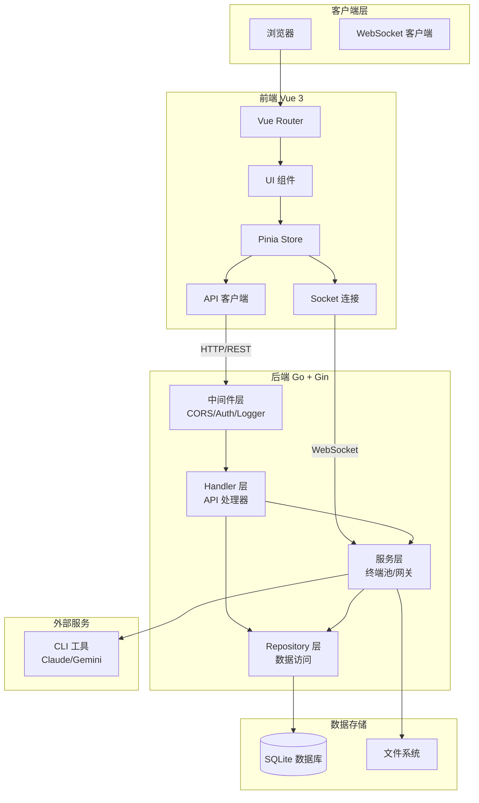

## 二、后端模块架构

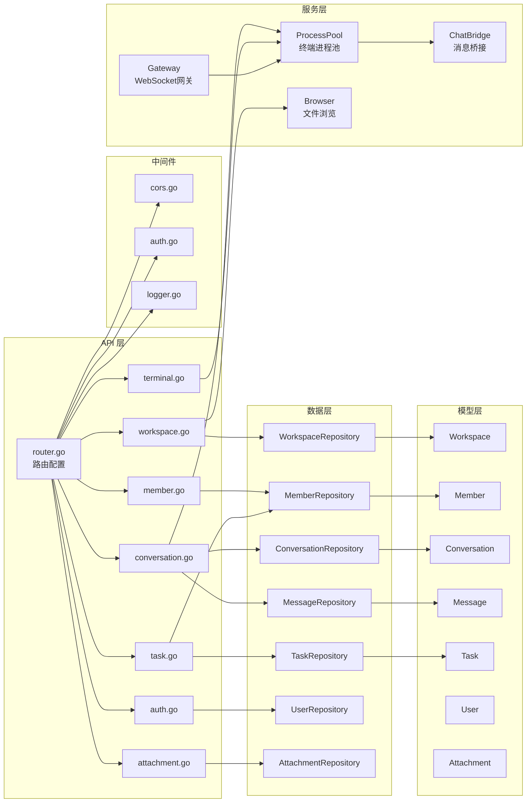

## 三、前端模块架构

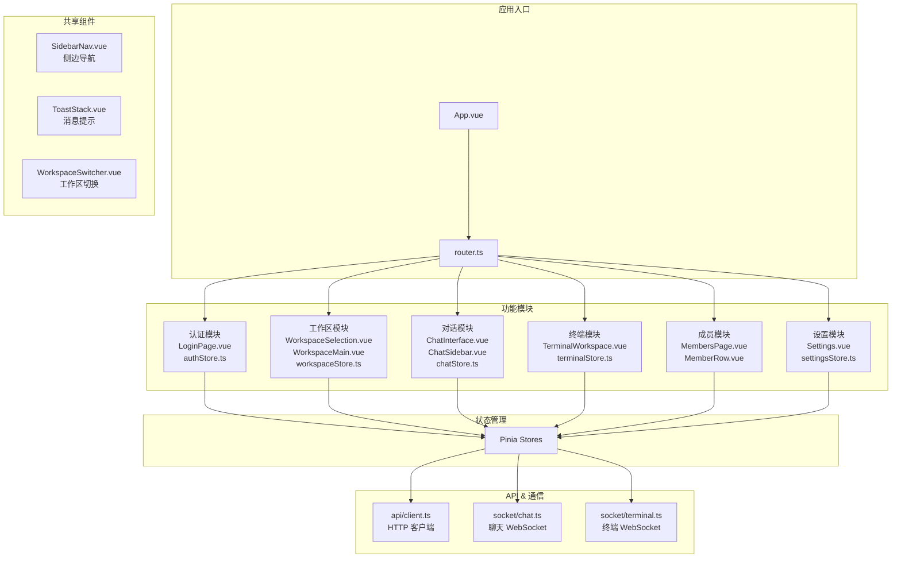

## 四、数据库模型关系

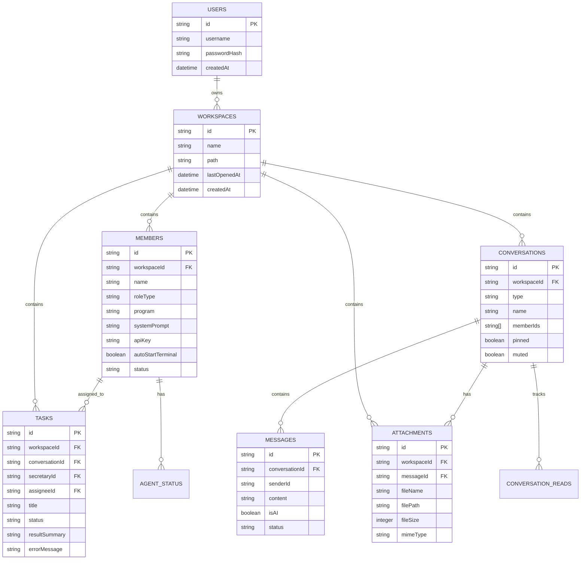

## 五、核心流程图

### 5.1 用户登录流程

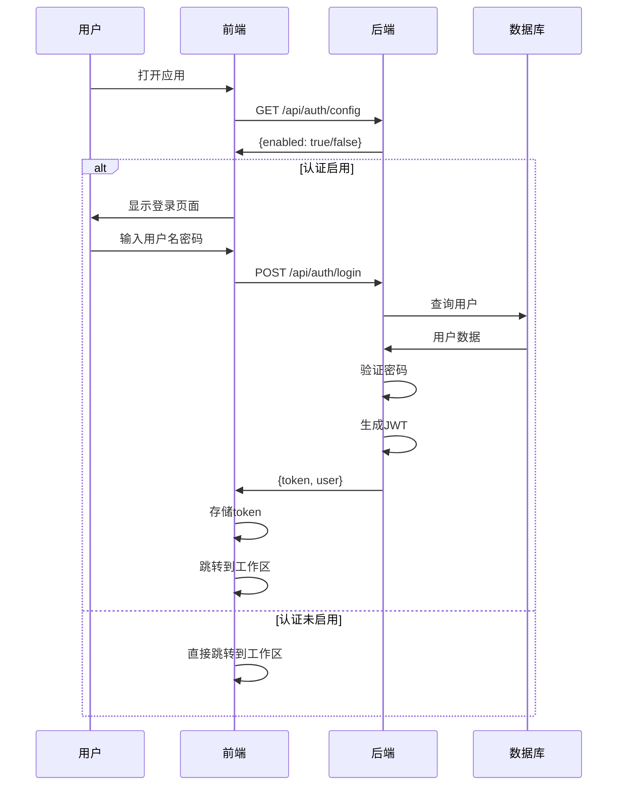

### 5.2 工作区管理流程

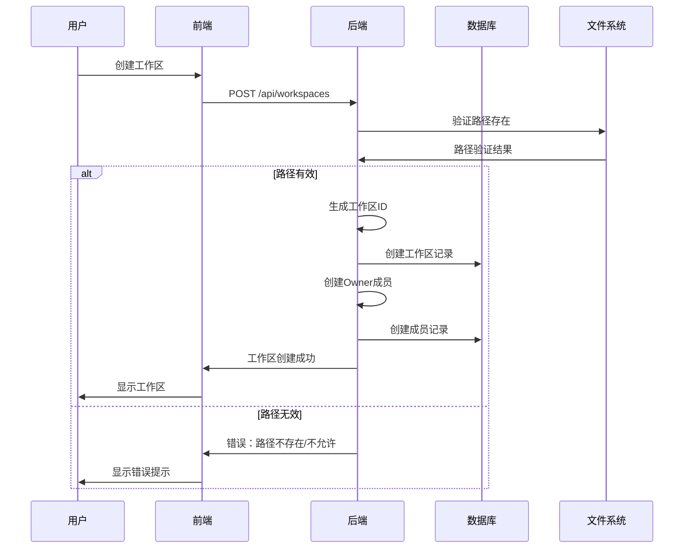

### 5.3 消息发送流程

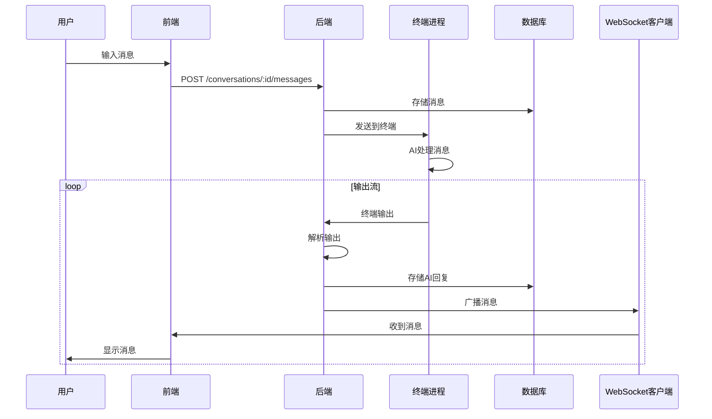

### 5.4 秘书协调流程

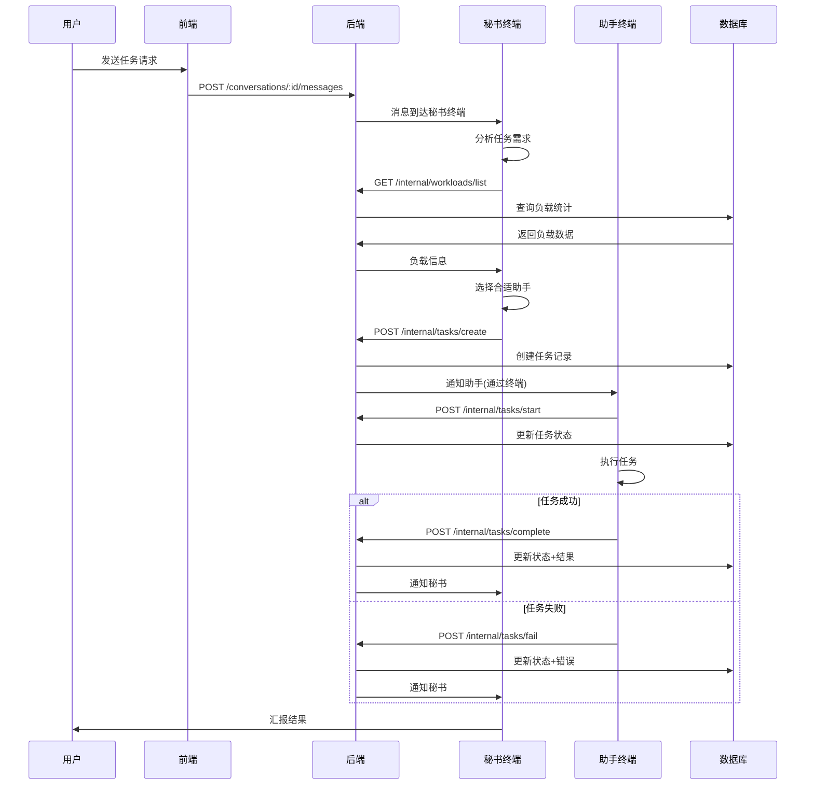

### 5.5 终端会话流程

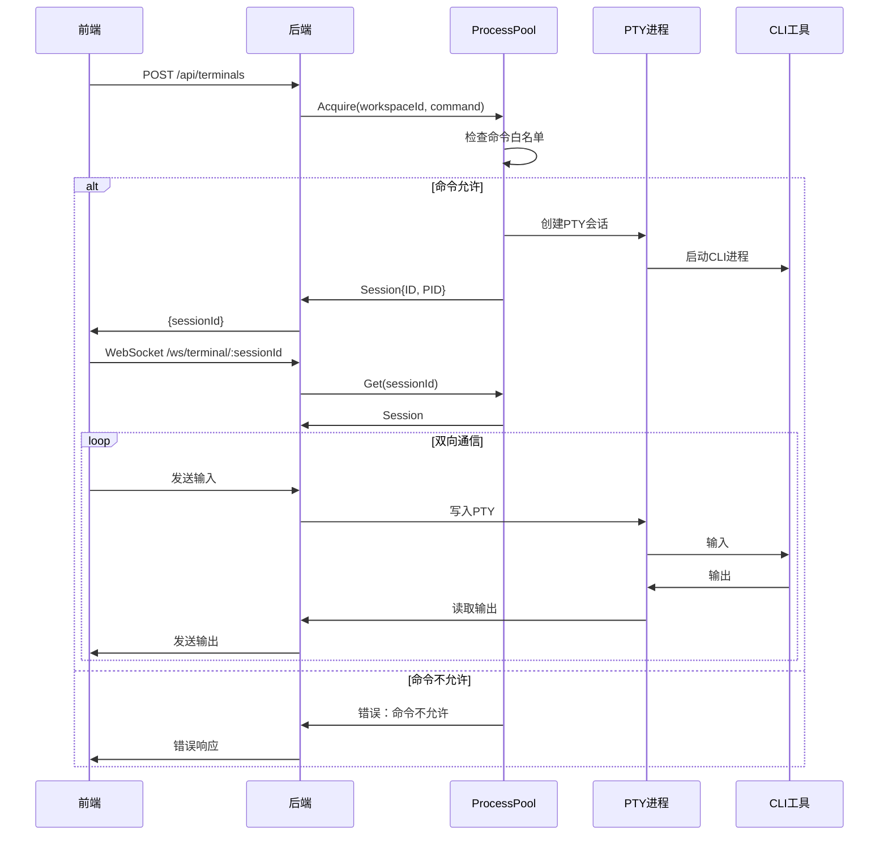

## 六、WebSocket 事件流程

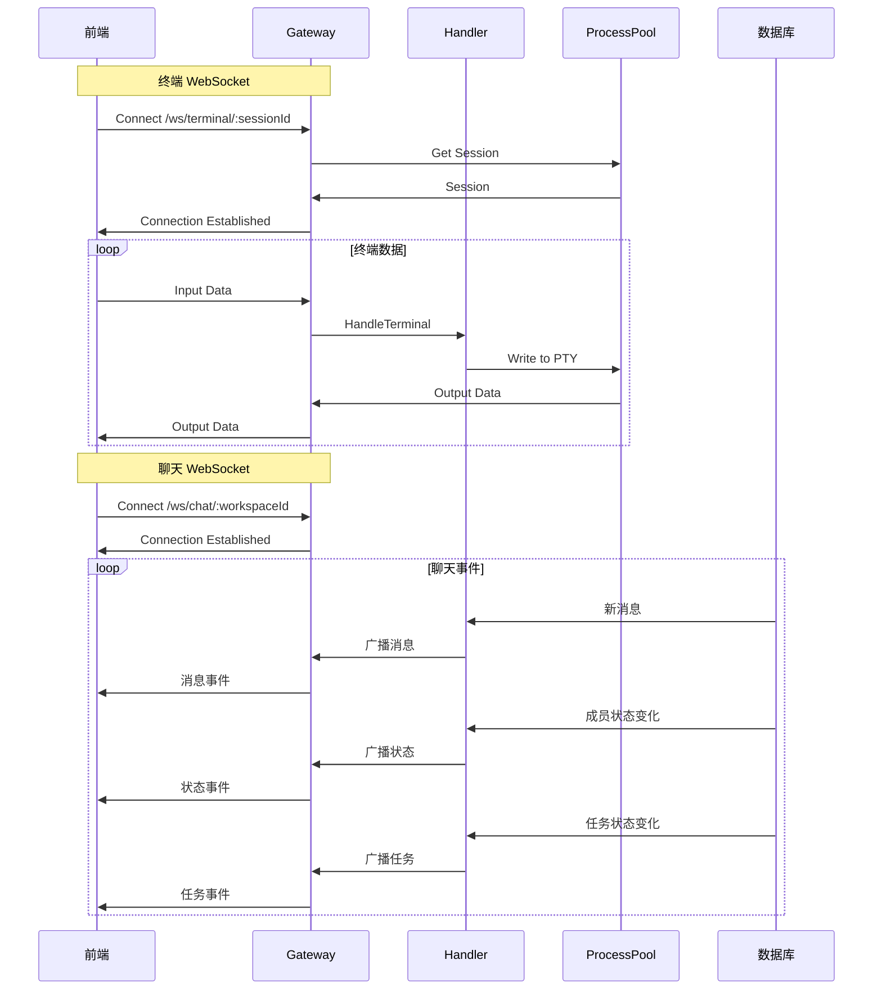

## 七、安全架构

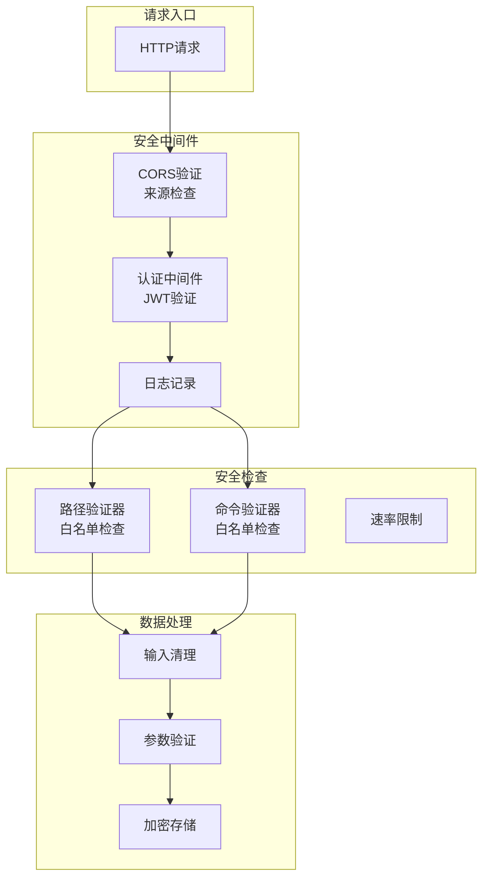

## 八、部署架构

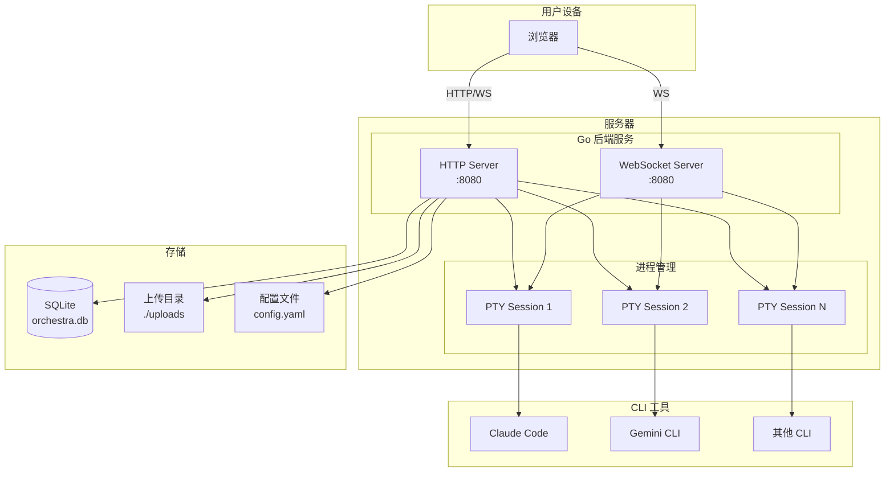

---

## 说明

1. **架构分层**：采用经典的三层架构（表现层、业务层、数据层）
2. **前后端分离**：Vue 3 前端 + Go 后端，通过 REST API 和 WebSocket 通信
3. **实时通信**：WebSocket 用于终端 I/O 和聊天消息推送
4. **进程管理**：PTY 进程池管理多个 CLI 会话
5. **安全机制**：路径/命令白名单、JWT 认证、CORS 验证