# Orchestra - UML 系统图

> 生成时间: 2026-04-18 | 基于当前代码库 (main 分支)

---

## 目录

1. [系统架构总览](#1-系统架构总览)
2. [后端分层图](#2-后端分层图)
3. [领域模型类图](#3-领域模型类图)
4. [A2A 会话管理](#4-a2a-会话管理)
5. [工具执行引擎](#5-工具执行引擎)
6. [消息桥接](#6-消息桥接)
7. [WebSocket 网关](#7-websocket-网关)
8. [前端组件树](#8-前端组件树)
9. [核心时序图](#9-核心时序图)
   - 9.1 用户登录
   - 9.2 消息发送与广播
   - 9.3 秘书分配任务
   - 9.4 工具调用循环
   - 9.5 A2A 会话生命周期
10. [状态机图](#10-状态机图)
    - 10.1 Task 状态机
    - 10.2 Member 角色
    - 10.3 Agent 活动状态
    - 10.4 Session 生命周期
11. [部署架构](#11-部署架构)
12. [数据库 ER 图](#12-数据库-er-图)

---

## 1. 系统架构总览

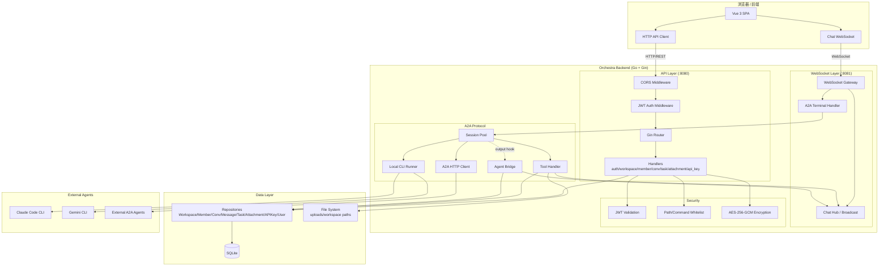
```mermaid
graph TB
    subgraph "浏览器 / 前端"
        Browser[Vue 3 SPA]
        WS_Chat[Chat WebSocket]
        API_C[HTTP API Client]
    end

    subgraph "Orchestra Backend (Go + Gin)"
        subgraph "API Layer (:8080)"
            Router[Gin Router]
            MW_CORS[CORS Middleware]
            MW_Auth[JWT Auth Middleware]
            Handlers[Handlers<br/>auth/workspace/member/conv/task/attachment/api_key]
        end

        subgraph "WebSocket Layer (:8081)"
            GW[WebSocket Gateway]
            A2ATerm[A2A Terminal Handler]
            ChatHub[Chat Hub / Broadcast]
        end

        subgraph "A2A Protocol"
            Pool[Session Pool]
            LocalRunner[Local CLI Runner]
            A2AClient[A2A HTTP Client]
            ToolHandler[Tool Handler]
            AgentBridge[Agent Bridge]
        end

        subgraph "Security"
            JWT[JWT Validation]
            Whitelist[Path/Command Whitelist]
            Crypto[AES-256-GCM Encryption]
        end
    end

    subgraph "Data Layer"
        Repos[Repositories<br/>Workspace/Member/Conv/Message/Task/Attachment/APIKey/User]
        SQLite[(SQLite)]
        FS[File System<br/>uploads/workspace paths]
    end

    subgraph "External Agents"
        Claude[Claude Code CLI]
        Gemini[Gemini CLI]
        A2A_Ext[External A2A Agents]
    end

    Browser --> API_C
    Browser --> WS_Chat
    API_C -->|HTTP/REST| MW_CORS
    WS_Chat -->|WebSocket| GW
    MW_CORS --> MW_Auth
    MW_Auth --> Router
    Router --> Handlers
    GW --> A2ATerm
    GW --> ChatHub

    Handlers --> JWT
    Handlers --> Whitelist
    Handlers --> Crypto
    Handlers --> Repos

    A2ATerm --> Pool
    Pool --> LocalRunner
    Pool --> A2AClient
    Pool --> ToolHandler

    ToolHandler --> Repos
    ToolHandler --> FS
    ToolHandler --> ChatHub

    AgentBridge --> Repos
    AgentBridge --> ChatHub
    Pool -.output hook.-> AgentBridge

    LocalRunner --> Claude
    LocalRunner --> Gemini
    A2AClient --> A2A_Ext

    Repos --> SQLite
```

---

## 2. 后端分层图

```mermaid
graph TB
    subgraph "Entry Point"
        Main[cmd/server/main.go<br/>init DB / security / pool / gateway / graceful shutdown]
    end

    subgraph "API Layer"
        Router2[api/router.go<br/>route definitions + middleware wiring]
        H_Auth[handlers/auth.go]
        H_WS[handlers/workspace.go]
        H_Member[handlers/member.go]
        H_Conv[handlers/conversation.go]
        H_Task[handlers/task.go]
        H_Attach[handlers/attachment.go]
        H_APIKey[handlers/api_key.go]
        H_Terminal[handlers/terminal.go]
        H_Health[handlers/health.go]
    end

    subgraph "Middleware"
        M_CORS[middleware/cors.go]
        M_Auth[middleware/auth.go]
        M_Logger[middleware/logger.go]
    end

    subgraph "WebSocket Layer"
        WS_GW[ws/gateway.go]
        WS_A2A[ws/a2a_terminal.go]
        WS_Chat[ws/chat.go - ChatHub + ChatHandler]
    end

    subgraph "A2A Protocol"
        A2A_Session[a2a/session.go]
        A2A_Pool[a2a/pool.go]
        A2A_Local[a2a/local_runner.go]
        A2A_Tools[a2a/tool_handler.go]
        A2A_Messages[a2a/messages.go]
        A2A_Registry[a2a/registry.go]
    end

    subgraph "Bridge"
        Bridge[chatbridge/agent_bridge.go]
    end

    subgraph "Security"
        S_JWT[security/jwt.go]
        S_Pass[security/password.go]
        S_Crypto[security/crypto.go]
        S_White[security/whitelist.go]
    end

    subgraph "File System"
        FS_Browser[filesystem/browser.go]
        FS_Validator[filesystem/validator.go]
    end

    subgraph "Config"
        Cfg_Config[config/config.go]
        Cfg_Loader[config/loader.go]
    end

    subgraph "Models"
        M_User[models/user.go]
        M_WS[models/workspace.go]
        M_Member[models/member.go]
        M_Task[models/task.go]
        M_Attach[models/attachment.go]
        M_APIKey[models/api_key.go]
        M_AgentStatus[models/agent_status.go]
    end

    subgraph "Storage"
        DB_Init[storage/database.go]
        R_Interface[storage/repository/interface.go]
        R_WS[storage/repository/workspace.go]
        R_Member[storage/repository/member.go]
        R_Conv[storage/repository/conversation.go]
        R_Msg[storage/repository/message.go]
        R_Task[storage/repository/task.go]
        R_Attach[storage/repository/attachment.go]
        R_APIKey[storage/repository/api_key.go]
        R_User[storage/repository/user.go]
        R_Reads[storage/repository/conversation_read.go]
    end

    Main --> Router2
    Main --> WS_GW
    Main --> Bridge
    Main --> S_White
    Main --> A2A_Pool

    Router2 --> M_CORS
    Router2 --> M_Auth
    Router2 --> M_Logger
    Router2 --> H_Auth
    Router2 --> H_WS
    Router2 --> H_Member
    Router2 --> H_Conv
    Router2 --> H_Task
    Router2 --> H_Attach
    Router2 --> H_APIKey
    Router2 --> H_Terminal
    Router2 --> H_Health

    WS_GW --> WS_A2A
    WS_GW --> WS_Chat

    A2A_Pool --> A2A_Session
    A2A_Pool --> A2A_Local
    A2A_Pool --> A2A_Tools
    A2A_Tools --> Bridge

    H_Auth --> S_JWT
    H_Auth --> S_Pass
    H_WS --> FS_Browser
    H_WS --> FS_Validator
    H_APIKey --> S_Crypto

    FS_Browser --> FS_Validator
```

---

## 3. 领域模型类图

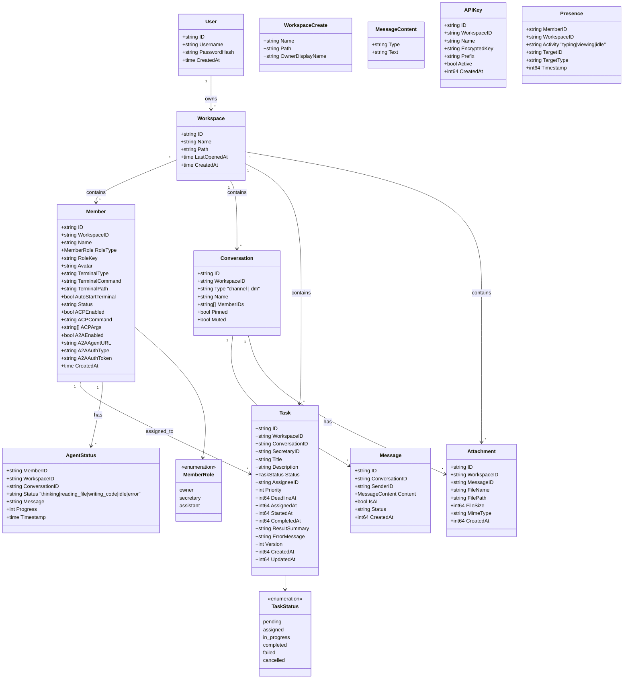
```mermaid
classDiagram
    class User {
        +string ID
        +string Username
        +string PasswordHash
        +time CreatedAt
    }

    class Workspace {
        +string ID
        +string Name
        +string Path
        +time LastOpenedAt
        +time CreatedAt
    }

    class WorkspaceCreate {
        +string Name
        +string Path
        +string OwnerDisplayName
    }

    class Member {
        +string ID
        +string WorkspaceID
        +string Name
        +MemberRole RoleType
        +string RoleKey
        +string Avatar
        +string TerminalType
        +string TerminalCommand
        +string TerminalPath
        +bool AutoStartTerminal
        +string Status
        +bool ACPEnabled
        +string ACPCommand
        +string[] ACPArgs
        +bool A2AEnabled
        +string A2AAgentURL
        +string A2AAuthType
        +string A2AAuthToken
        +time CreatedAt
    }

    class MemberRole {
        <<enumeration>>
        owner
        secretary
        assistant
    }

    class Conversation {
        +string ID
        +string WorkspaceID
        +string Type "channel | dm"
        +string Name
        +string[] MemberIDs
        +bool Pinned
        +bool Muted
    }

    class Message {
        +string ID
        +string ConversationID
        +string SenderID
        +MessageContent Content
        +bool IsAI
        +string Status
        +int64 CreatedAt
    }

    class MessageContent {
        +string Type
        +string Text
    }

    class Task {
        +string ID
        +string WorkspaceID
        +string ConversationID
        +string SecretaryID
        +string Title
        +string Description
        +TaskStatus Status
        +string AssigneeID
        +int Priority
        +int64 DeadlineAt
        +int64 AssignedAt
        +int64 StartedAt
        +int64 CompletedAt
        +string ResultSummary
        +string ErrorMessage
        +int Version
        +int64 CreatedAt
        +int64 UpdatedAt
    }

    class TaskStatus {
        <<enumeration>>
        pending
        assigned
        in_progress
        completed
        failed
        cancelled
    }

    class Attachment {
        +string ID
        +string WorkspaceID
        +string MessageID
        +string FileName
        +string FilePath
        +int64 FileSize
        +string MimeType
        +int64 CreatedAt
    }

    class APIKey {
        +string ID
        +string WorkspaceID
        +string Name
        +string EncryptedKey
        +string Prefix
        +bool Active
        +int64 CreatedAt
    }

    class AgentStatus {
        +string MemberID
        +string WorkspaceID
        +string ConversationID
        +string Status "thinking|reading_file|writing_code|idle|error"
        +string Message
        +int Progress
        +time Timestamp
    }

    class Presence {
        +string MemberID
        +string WorkspaceID
        +string Activity "typing|viewing|idle"
        +string TargetID
        +string TargetType
        +int64 Timestamp
    }

    Workspace "1" --> "*" Member : contains
    Workspace "1" --> "*" Conversation : contains
    Workspace "1" --> "*" Task : contains
    Workspace "1" --> "*" Attachment : contains
    User "1" --> "*" Workspace : owns
    Member "1" --> "*" Task : assigned_to
    Member "1" --> "*" AgentStatus : has
    Member --> MemberRole
    Conversation "1" --> "*" Message : contains
    Conversation "1" --> "*" Attachment : has
    Task --> TaskStatus
```

---

## 4. A2A 会话管理

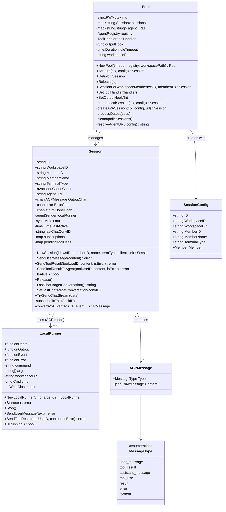
```mermaid
classDiagram
    class Pool {
        -sync.RWMutex mu
        -map~string,Session~ sessions
        -map~string,string~ agentURLs
        -AgentRegistry registry
        -ToolHandler toolHandler
        -func outputHook
        -time.Duration idleTimeout
        -string workspacePath
        +NewPool(timeout, registry, workspacePath) Pool
        +Acquire(ctx, config) Session
        +Get(id) Session
        +Release(id)
        +SessionForWorkspaceMember(wsID, memberID) Session
        +SetToolHandler(handler)
        +SetOutputHook(fn)
        -createLocalSession(ctx, config) Session
        -createA2ASession(ctx, config, url) Session
        -processOutput(sess)
        -cleanupIdleSessions()
        -resolveAgentURL(config) string
    }

    class Session {
        +string ID
        +string WorkspaceID
        +string MemberID
        +string MemberName
        +string TerminalType
        +a2aclient.Client Client
        +string AgentURL
        +chan ACPMessage OutputChan
        +chan error ErrorChan
        +chan struct DoneChan
        -agentSender localRunner
        -sync.Mutex mu
        -time.Time lastActive
        -string lastChatConvID
        -map subscriptions
        -map pendingToolUses
        +NewSession(id, wsID, memberID, name, termType, client, url) Session
        +SendUserMessage(content) error
        +SendToolResult(toolUseID, content, isError) error
        +SendToolResultToAgent(toolUseID, content, isError) error
        +IsAlive() bool
        +Release()
        +LastChatTargetConversation() string
        +SetLastChatTargetConversation(convID)
        +TrySendChatStream(data)
        -subscribeToTask(taskID)
        -convertA2AEventToACP(event) ACPMessage
    }

    class LocalRunner {
        +func onDeath
        +func onOutput
        +func onEvent
        +func onError
        -string command
        -string[] args
        -string workspaceDir
        -cmd.Cmd cmd
        -io.WriteCloser stdin
        +NewLocalRunner(cmd, args, dir) LocalRunner
        +Start(ctx) error
        +Stop()
        +SendUserMessage(text) error
        +SendToolResult(toolUseID, content, isError) error
        +IsRunning() bool
    }

    class ACPMessage {
        +MessageType Type
        +json.RawMessage Content
    }

    class MessageType {
        <<enumeration>>
        user_message
        tool_result
        assistant_message
        tool_use
        result
        error
        system
    }

    class SessionConfig {
        +string ID
        +string WorkspaceID
        +string WorkspaceDir
        +string MemberID
        +string MemberName
        +string TerminalType
        +Member Member
    }

    Pool "1" --> "*" Session : manages
    Session "1" --> "0..1" LocalRunner : uses (ACP mode)
    Session "1" --> "*" ACPMessage : produces
    ACPMessage --> MessageType
    Pool --> SessionConfig : creates with
```

---

## 5. 工具执行引擎

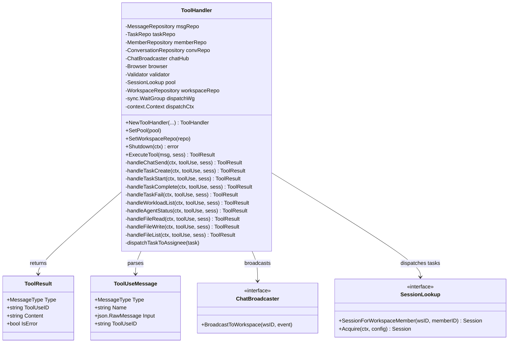
```mermaid
classDiagram
    class ToolHandler {
        -MessageRepository msgRepo
        -TaskRepo taskRepo
        -MemberRepository memberRepo
        -ConversationRepository convRepo
        -ChatBroadcaster chatHub
        -Browser browser
        -Validator validator
        -SessionLookup pool
        -WorkspaceRepository workspaceRepo
        -sync.WaitGroup dispatchWg
        -context.Context dispatchCtx
        +NewToolHandler(...) ToolHandler
        +SetPool(pool)
        +SetWorkspaceRepo(repo)
        +Shutdown(ctx) error
        +ExecuteTool(msg, sess) ToolResult
        -handleChatSend(ctx, toolUse, sess) ToolResult
        -handleTaskCreate(ctx, toolUse, sess) ToolResult
        -handleTaskStart(ctx, toolUse, sess) ToolResult
        -handleTaskComplete(ctx, toolUse, sess) ToolResult
        -handleTaskFail(ctx, toolUse, sess) ToolResult
        -handleWorkloadList(ctx, toolUse, sess) ToolResult
        -handleAgentStatus(ctx, toolUse, sess) ToolResult
        -handleFileRead(ctx, toolUse, sess) ToolResult
        -handleFileWrite(ctx, toolUse, sess) ToolResult
        -handleFileList(ctx, toolUse, sess) ToolResult
        -dispatchTaskToAssignee(task)
    }

    class ToolResult {
        +MessageType Type
        +string ToolUseID
        +string Content
        +bool IsError
    }

    class ToolUseMessage {
        +MessageType Type
        +string Name
        +json.RawMessage Input
        +string ToolUseID
    }

    class ChatBroadcaster {
        <<interface>>
        +BroadcastToWorkspace(wsID, event)
    }

    class SessionLookup {
        <<interface>>
        +SessionForWorkspaceMember(wsID, memberID) Session
        +Acquire(ctx, config) Session
    }

    ToolHandler --> ToolResult : returns
    ToolHandler --> ToolUseMessage : parses
    ToolHandler --> ChatBroadcaster : broadcasts
    ToolHandler --> SessionLookup : dispatches tasks
```

### 工具清单

| 工具名 | 用途 | 输入参数 | 返回值 |
|--------|------|----------|--------|
| `orchestra_chat_send` | 向对话发送消息 | conversationId, text | messageId, sentAt |
| `orchestra_task_create` | 创建任务 | conversationId, title, description, assigneeId, priority | taskId, status |
| `orchestra_task_start` | 开始任务 | taskId | status: in_progress |
| `orchestra_task_complete` | 完成任务 | taskId, resultSummary | status: completed |
| `orchestra_task_fail` | 标记任务失败 | taskId, errorMessage | status: failed |
| `orchestra_workload_list` | 查询负载统计 | workspaceId | AgentWorkload[] |
| `orchestra_agent_status` | 更新 Agent 状态 | status, message, progress | success |
| `orchestra_file_read` | 读取文件 | path | file content |
| `orchestra_file_write` | 写入文件 | path, content | success |
| `orchestra_file_list` | 列出目录 | path | entries[] |

---

## 6. 消息桥接

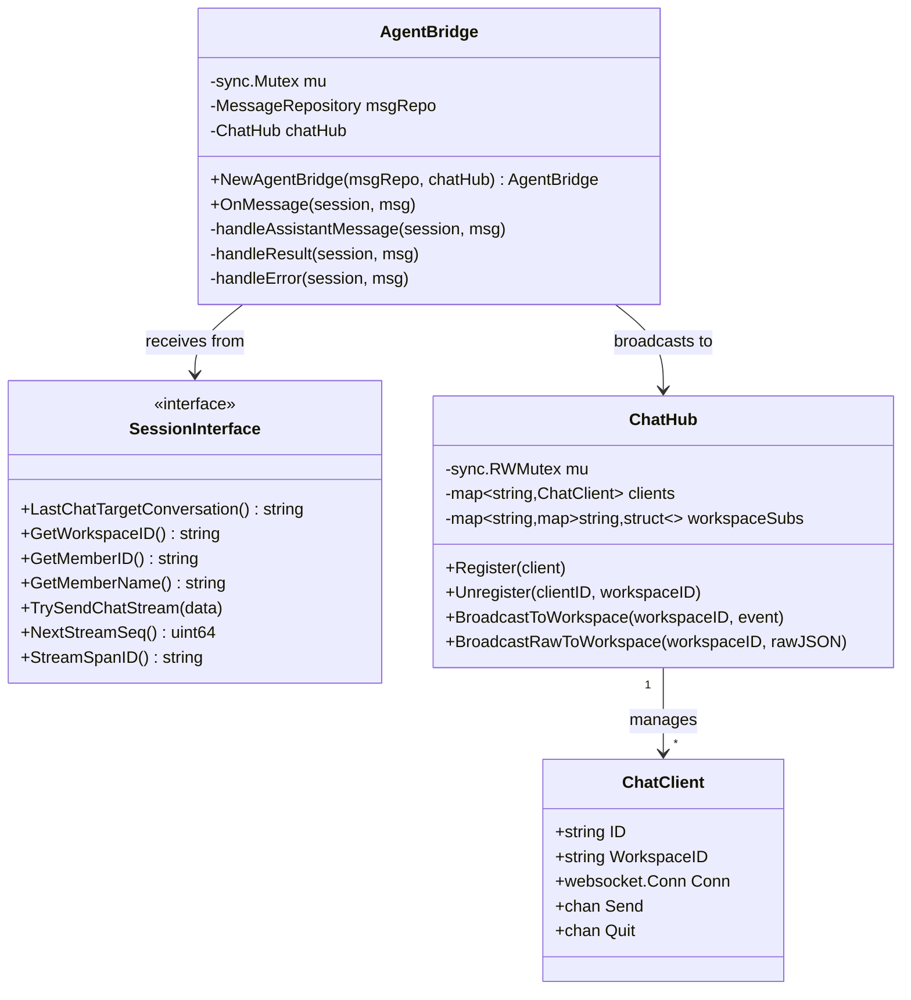
```mermaid
classDiagram
    class AgentBridge {
        -sync.Mutex mu
        -MessageRepository msgRepo
        -ChatHub chatHub
        +NewAgentBridge(msgRepo, chatHub) AgentBridge
        +OnMessage(session, msg)
        -handleAssistantMessage(session, msg)
        -handleResult(session, msg)
        -handleError(session, msg)
    }

    class SessionInterface {
        <<interface>>
        +LastChatTargetConversation() string
        +GetWorkspaceID() string
        +GetMemberID() string
        +GetMemberName() string
        +TrySendChatStream(data)
        +NextStreamSeq() uint64
        +StreamSpanID() string
    }

    class ChatHub {
        -sync.RWMutex mu
        -map~string,ChatClient~ clients
        -map~string,map~string,struct~~ workspaceSubs
        +Register(client)
        +Unregister(clientID, workspaceID)
        +BroadcastToWorkspace(workspaceID, event)
        +BroadcastRawToWorkspace(workspaceID, rawJSON)
    }

    class ChatClient {
        +string ID
        +string WorkspaceID
        +websocket.Conn Conn
        +chan Send
        +chan Quit
    }

    AgentBridge --> SessionInterface : receives from
    AgentBridge --> ChatHub : broadcasts to
    ChatHub "1" --> "*" ChatClient : manages
```

---

## 7. WebSocket 网关

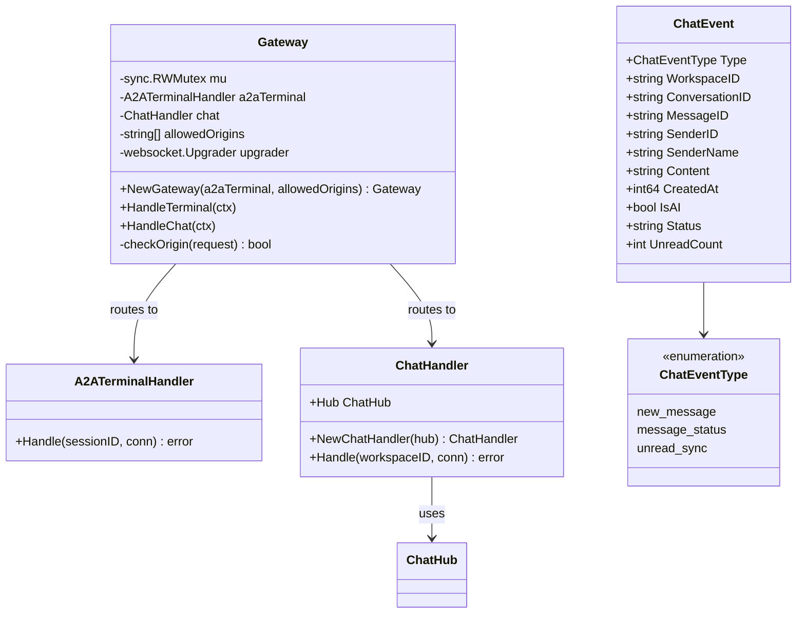
```mermaid
classDiagram
    class Gateway {
        -sync.RWMutex mu
        -A2ATerminalHandler a2aTerminal
        -ChatHandler chat
        -string[] allowedOrigins
        -websocket.Upgrader upgrader
        +NewGateway(a2aTerminal, allowedOrigins) Gateway
        +HandleTerminal(ctx)
        +HandleChat(ctx)
        -checkOrigin(request) bool
    }

    class A2ATerminalHandler {
        +Handle(sessionID, conn) error
    }

    class ChatHandler {
        +Hub ChatHub
        +NewChatHandler(hub) ChatHandler
        +Handle(workspaceID, conn) error
    }

    class ChatEvent {
        +ChatEventType Type
        +string WorkspaceID
        +string ConversationID
        +string MessageID
        +string SenderID
        +string SenderName
        +string Content
        +int64 CreatedAt
        +bool IsAI
        +string Status
        +int UnreadCount
    }

    class ChatEventType {
        <<enumeration>>
        new_message
        message_status
        unread_sync
    }

    Gateway --> A2ATerminalHandler : routes to
    Gateway --> ChatHandler : routes to
    ChatHandler --> ChatHub : uses
    ChatEvent --> ChatEventType
```

---

## 8. 前端组件树


```mermaid
graph TB
    App[App.vue] --> Router[router.ts]
    Router --> Login[LoginPage.vue]
    Router --> WSel[WorkspaceSelection.vue]
    Router --> WMain[WorkspaceMain.vue]

    WMain --> Sidebar[SidebarNav.vue]
    WMain --> WSwitcher[WorkspaceSwitcher.vue]
    WMain --> PathBrowser[PathBrowser.vue]
    WMain --> NavTabs[Navigation Tabs]

    NavTabs --> Chat[ChatInterface.vue]
    NavTabs --> Tasks[TasksPage.vue]
    NavTabs --> Members[MembersPage.vue]
    NavTabs --> Settings[Settings.vue]

    Chat --> ChatSidebar[ChatSidebar.vue]
    Chat --> ChatHeader[ChatHeader.vue]
    Chat --> MessagesList[MessagesList.vue]
    Chat --> ChatInput[ChatInput.vue]
    Chat --> MembersSB[MembersSidebar.vue]
    Chat --> CreateConvModal[CreateConversationModal.vue]
    Chat --> InviteMenu[InviteMenu.vue]

    Tasks --> TasksKanban[TasksKanban.vue]
    Tasks --> TaskCard[TaskCard.vue]
    Tasks --> TaskActionModal[TaskActionModal.vue]
    Tasks --> TaskDetailDrawer[TaskDetailDrawer.vue]

    Members --> MemberRow[MemberRow.vue]
    Members --> AddMemberModal[AddMemberModal.vue]
    Members --> EditMemberModal[EditMemberModal.vue]

    Settings --> ApiKeysSection[ApiKeysSection.vue]

    subgraph "Stores (Pinia)"
        AuthStore[authStore]
        WStore[workspaceStore]
        ProjStore[projectStore]
        ChatStore[chatStore]
        TaskStore[taskStore]
        MemberStore[memberStore]
        SettingsStore[settingsStore]
        APIKeyStore[apiKeyStore]
        ToastStore[toastStore]
        NotifStore[notificationStore]
    end

    Login --> AuthStore
    WSel --> WStore
    WMain --> WStore
    WMain --> ProjStore
    Chat --> ChatStore
    Tasks --> TaskStore
    Members --> MemberStore
    Settings --> SettingsStore
    Settings --> APIKeyStore

    subgraph "Socket Layer"
        ChatSocket[socket/chat.ts - ChatSocket class]
    end

    ChatStore --> ChatSocket
```

---

## 9. 核心时序图

### 9.1 用户登录

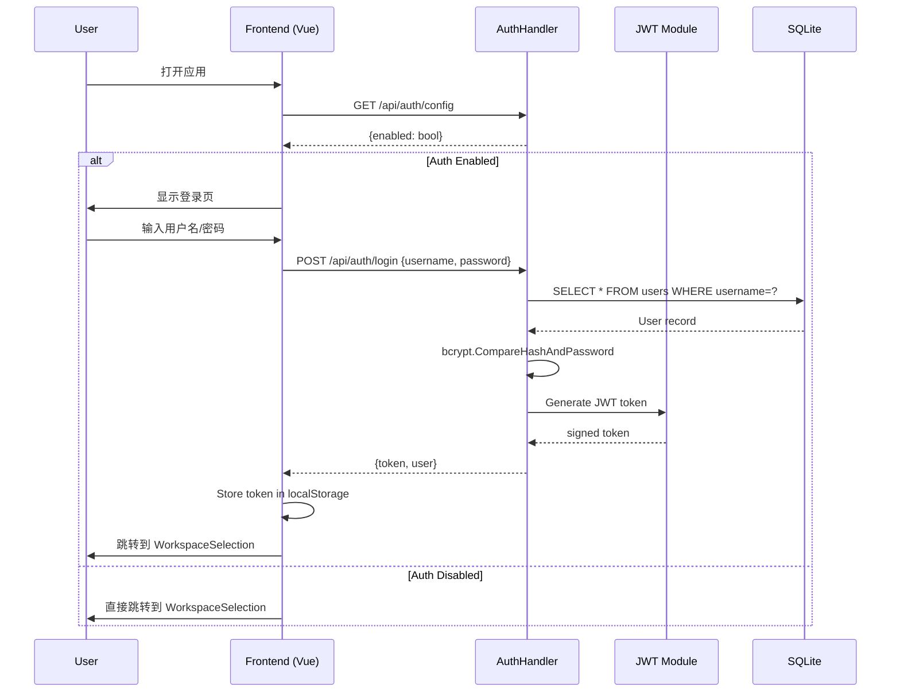
```mermaid
sequenceDiagram
    participant U as User
    participant FE as Frontend (Vue)
    participant Auth as AuthHandler
    participant JWT as JWT Module
    participant DB as SQLite

    U->>FE: 打开应用
    FE->>Auth: GET /api/auth/config
    Auth-->>FE: {enabled: bool}

    alt Auth Enabled
        FE->>U: 显示登录页
        U->>FE: 输入用户名/密码
        FE->>Auth: POST /api/auth/login {username, password}
        Auth->>DB: SELECT * FROM users WHERE username=?
        DB-->>Auth: User record
        Auth->>Auth: bcrypt.CompareHashAndPassword
        Auth->>JWT: Generate JWT token
        JWT-->>Auth: signed token
        Auth-->>FE: {token, user}
        FE->>FE: Store token in localStorage
        FE->>U: 跳转到 WorkspaceSelection
    else Auth Disabled
        FE->>U: 直接跳转到 WorkspaceSelection
    end
```

### 9.2 消息发送与广播

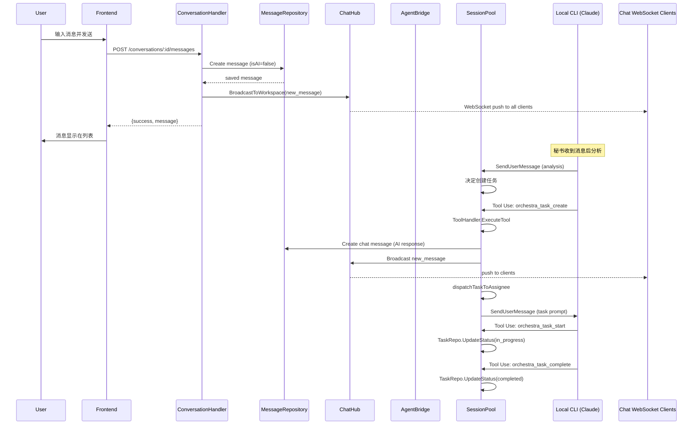
```mermaid
sequenceDiagram
    participant U as User
    participant FE as Frontend
    participant ConvH as ConversationHandler
    participant MsgRepo as MessageRepository
    participant ChatH as ChatHub
    participant Bridge as AgentBridge
    participant Pool as SessionPool
    participant CLI as Local CLI (Claude)
    participant WS as Chat WebSocket Clients

    U->>FE: 输入消息并发送
    FE->>ConvH: POST /conversations/:id/messages
    ConvH->>MsgRepo: Create message (isAI=false)
    MsgRepo-->>ConvH: saved message
    ConvH->>ChatH: BroadcastToWorkspace(new_message)
    ChatH-->>WS: WebSocket push to all clients
    ConvH-->>FE: {success, message}
    FE->>U: 消息显示在列表

    Note over CLI: 秘书收到消息后分析
    CLI->>Pool: SendUserMessage (analysis)
    Pool->>Pool: 决定创建任务

    CLI->>Pool: Tool Use: orchestra_task_create
    Pool->>Pool: ToolHandler.ExecuteTool
    Pool->>MsgRepo: Create chat message (AI response)
    Pool->>ChatH: Broadcast new_message
    ChatH-->>WS: push to clients
    Pool->>Pool: dispatchTaskToAssignee
    Pool->>CLI: SendUserMessage (task prompt)

    CLI->>Pool: Tool Use: orchestra_task_start
    Pool->>Pool: TaskRepo.UpdateStatus(in_progress)

    CLI->>Pool: Tool Use: orchestra_task_complete
    Pool->>Pool: TaskRepo.UpdateStatus(completed)
```

### 9.3 秘书分配任务 (Secretary → Assistant)

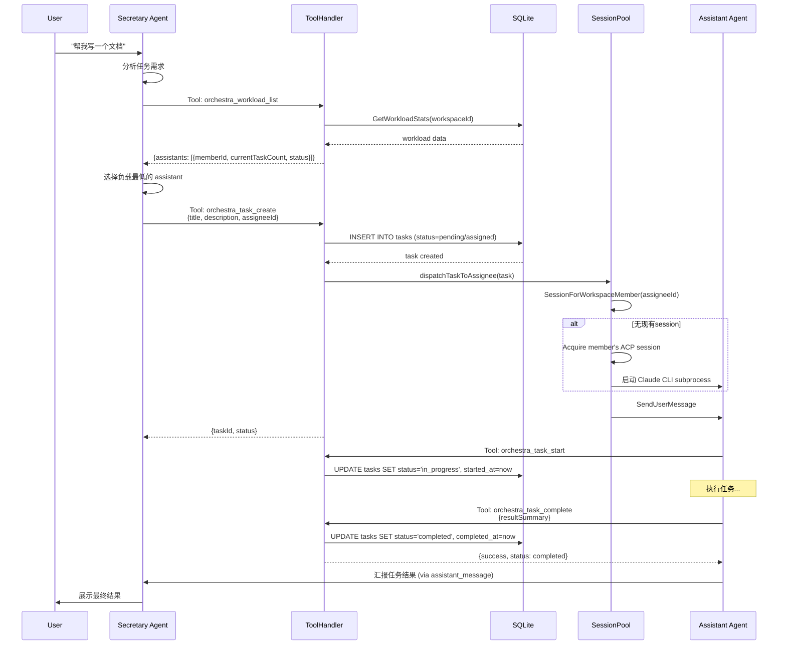
```mermaid
sequenceDiagram
    participant User
    participant Sec as Secretary Agent
    participant TH as ToolHandler
    participant DB as SQLite
    participant Pool as SessionPool
    participant Asst as Assistant Agent

    User->>Sec: "帮我写一个文档"
    Sec->>Sec: 分析任务需求

    Sec->>TH: Tool: orchestra_workload_list
    TH->>DB: GetWorkloadStats(workspaceId)
    DB-->>TH: workload data
    TH-->>Sec: {assistants: [{memberId, currentTaskCount, status}]}

    Sec->>Sec: 选择负载最低的 assistant

    Sec->>TH: Tool: orchestra_task_create<br/>{title, description, assigneeId}
    TH->>DB: INSERT INTO tasks (status=pending/assigned)
    DB-->>TH: task created

    TH->>Pool: dispatchTaskToAssignee(task)
    Pool->>Pool: SessionForWorkspaceMember(assigneeId)
    alt 无现有session
        Pool->>Pool: Acquire member's ACP session
        Pool->>Asst: 启动 Claude CLI subprocess
    end
    Pool->>Asst: SendUserMessage<br/>#conversationId{X}#taskId{Y}[秘书分配任务]: Z
    TH-->>Sec: {taskId, status}

    Asst->>TH: Tool: orchestra_task_start
    TH->>DB: UPDATE tasks SET status='in_progress', started_at=now

    Note over Asst: 执行任务...

    Asst->>TH: Tool: orchestra_task_complete<br/>{resultSummary}
    TH->>DB: UPDATE tasks SET status='completed', completed_at=now
    TH-->>Asst: {success, status: completed}

    Asst->>Sec: 汇报任务结果 (via assistant_message)
    Sec->>User: 展示最终结果
```

### 9.4 工具调用循环 (Tool Use Loop)

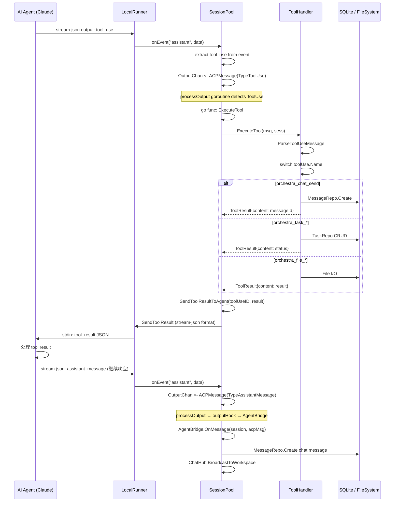
```mermaid
sequenceDiagram
    participant Agent as AI Agent (Claude)
    participant LR as LocalRunner
    participant Pool as SessionPool
    participant TH as ToolHandler
    participant DB as SQLite / FileSystem

    Agent->>LR: stream-json output: tool_use
    LR->>Pool: onEvent("assistant", data)
    Pool->>Pool: extract tool_use from event
    Pool->>Pool: OutputChan <- ACPMessage(TypeToolUse)

    Note over Pool: processOutput goroutine detects ToolUse

    Pool->>Pool: go func: ExecuteTool
    Pool->>TH: ExecuteTool(msg, sess)
    TH->>TH: ParseToolUseMessage
    TH->>TH: switch toolUse.Name

    alt orchestra_chat_send
        TH->>DB: MessageRepo.Create
        TH-->>Pool: ToolResult{content: messageId}
    else orchestra_task_*
        TH->>DB: TaskRepo CRUD
        TH-->>Pool: ToolResult{content: status}
    else orchestra_file_*
        TH->>DB: File I/O
        TH-->>Pool: ToolResult{content: result}
    end

    Pool->>Pool: SendToolResultToAgent(toolUseID, result)
    Pool->>LR: SendToolResult (stream-json format)
    LR->>Agent: stdin: tool_result JSON

    Agent->>Agent: 处理 tool result
    Agent->>LR: stream-json: assistant_message (继续响应)
    LR->>Pool: onEvent("assistant", data)
    Pool->>Pool: OutputChan <- ACPMessage(TypeAssistantMessage)

    Note over Pool: processOutput → outputHook → AgentBridge
    Pool->>Pool: AgentBridge.OnMessage(session, acpMsg)
    Pool->>DB: MessageRepo.Create chat message
    Pool->>Pool: ChatHub.BroadcastToWorkspace
```

### 9.5 A2A 会话生命周期

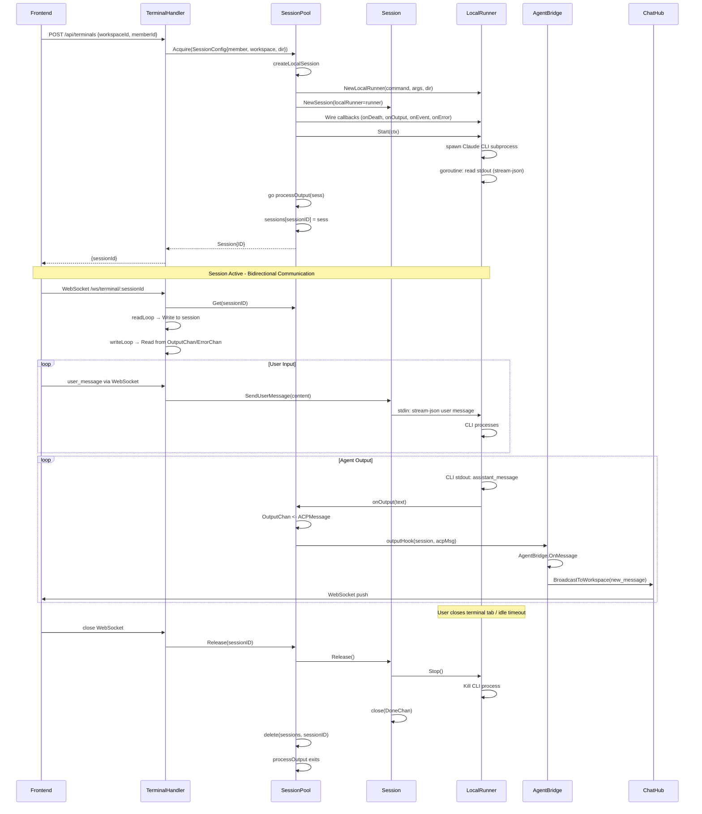
```mermaid
sequenceDiagram
    participant FE as Frontend
    participant API as TerminalHandler
    participant Pool as SessionPool
    participant Session as Session
    participant Runner as LocalRunner
    participant Bridge as AgentBridge
    participant ChatHub as ChatHub

    FE->>API: POST /api/terminals {workspaceId, memberId}
    API->>Pool: Acquire(SessionConfig{member, workspace, dir})
    Pool->>Pool: createLocalSession
    Pool->>Runner: NewLocalRunner(command, args, dir)
    Pool->>Session: NewSession(localRunner=runner)
    Pool->>Runner: Wire callbacks (onDeath, onOutput, onEvent, onError)
    Pool->>Runner: Start(ctx)
    Runner->>Runner: spawn Claude CLI subprocess
    Runner->>Runner: goroutine: read stdout (stream-json)
    Pool->>Pool: go processOutput(sess)
    Pool->>Pool: sessions[sessionID] = sess
    Pool-->>API: Session{ID}
    API-->>FE: {sessionId}

    Note over FE,Runner: Session Active - Bidirectional Communication

    FE->>API: WebSocket /ws/terminal/:sessionId
    API->>Pool: Get(sessionID)
    API->>API: readLoop → Write to session
    API->>API: writeLoop → Read from OutputChan/ErrorChan

    loop User Input
        FE->>API: user_message via WebSocket
        API->>Session: SendUserMessage(content)
        Session->>Runner: stdin: stream-json user message
        Runner->>Runner: CLI processes
    end

    loop Agent Output
        Runner->>Runner: CLI stdout: assistant_message
        Runner->>Pool: onOutput(text)
        Pool->>Pool: OutputChan <- ACPMessage
        Pool->>Bridge: outputHook(session, acpMsg)
        Bridge->>Bridge: AgentBridge.OnMessage
        Bridge->>ChatHub: BroadcastToWorkspace(new_message)
        ChatHub->>FE: WebSocket push
    end

    Note over Runner: User closes terminal tab / idle timeout
    FE->>API: close WebSocket
    API->>Pool: Release(sessionID)
    Pool->>Session: Release()
    Session->>Runner: Stop()
    Runner->>Runner: Kill CLI process
    Session->>Session: close(DoneChan)
    Pool->>Pool: delete(sessions, sessionID)
    Pool->>Pool: processOutput exits
```

---

## 10. 状态机图

### 10.1 Task 状态机

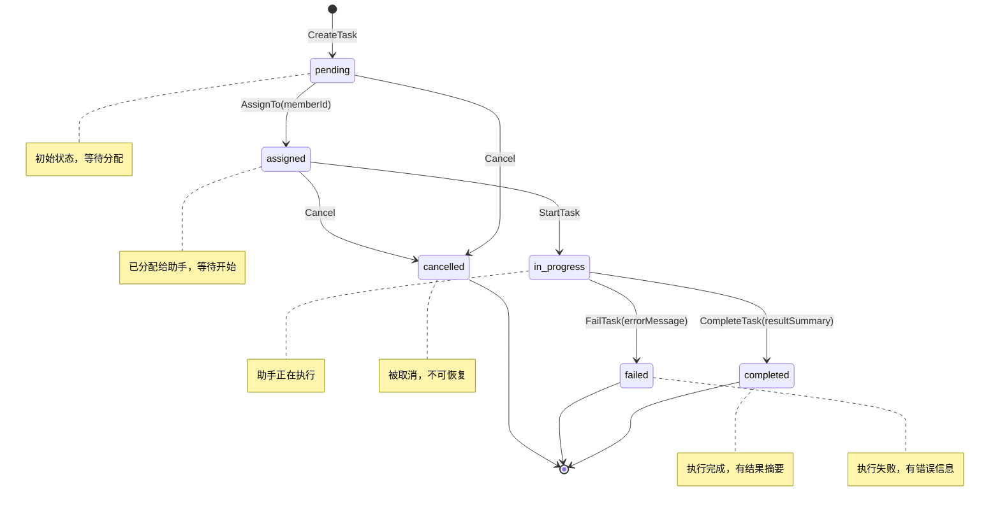
```mermaid
stateDiagram-v2
    [*] --> pending : CreateTask

    pending --> assigned : AssignTo(memberId)
    pending --> cancelled : Cancel

    assigned --> in_progress : StartTask
    assigned --> cancelled : Cancel

    in_progress --> completed : CompleteTask(resultSummary)
    in_progress --> failed : FailTask(errorMessage)

    completed --> [*]
    failed --> [*]
    cancelled --> [*]

    note right of pending
        初始状态，等待分配
    end note
    note right of assigned
        已分配给助手，等待开始
    end note
    note right of in_progress
        助手正在执行
    end note
    note right of completed
        执行完成，有结果摘要
    end note
    note right of failed
        执行失败，有错误信息
    end note
    note right of cancelled
        被取消，不可恢复
    end note
```

### 10.2 Member 角色关系

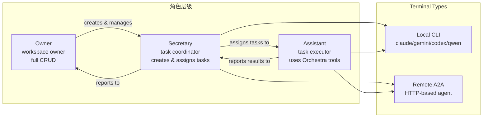
```mermaid
graph LR
    subgraph "角色层级"
        Owner[Owner<br/>workspace owner<br/>full CRUD]
        Secretary[Secretary<br/>task coordinator<br/>creates & assigns tasks]
        Assistant[Assistant<br/>task executor<br/>uses Orchestra tools]
    end

    Owner -->|creates & manages| Secretary
    Secretary -->|assigns tasks to| Assistant
    Assistant -->|reports results to| Secretary
    Secretary -->|reports to| Owner

    subgraph "Terminal Types"
        LocalCLI[Local CLI<br/>claude/gemini/codex/qwen]
        RemoteA2A[Remote A2A<br/>HTTP-based agent]
    end

    Secretary --> LocalCLI
    Secretary --> RemoteA2A
    Assistant --> LocalCLI
    Assistant --> RemoteA2A
```

### 10.3 Agent 活动状态

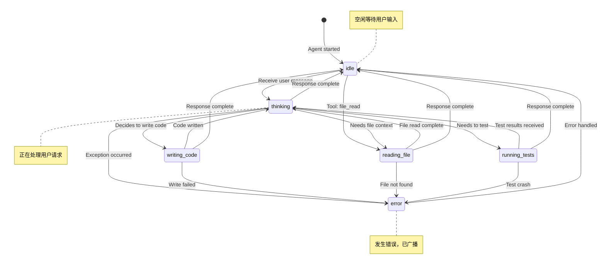
```mermaid
stateDiagram-v2
    [*] --> idle : Agent started

    idle --> thinking : Receive user message
    idle --> reading_file : Tool: file_read

    thinking --> writing_code : Decides to write code
    thinking --> reading_file : Needs file context
    thinking --> running_tests : Needs to test
    thinking --> idle : Response complete

    writing_code --> thinking : Code written
    writing_code --> idle : Response complete

    reading_file --> thinking : File read complete
    reading_file --> idle : Response complete

    running_tests --> thinking : Test results received
    running_tests --> idle : Response complete

    thinking --> error : Exception occurred
    writing_code --> error : Write failed
    reading_file --> error : File not found
    running_tests --> error : Test crash

    error --> idle : Error handled

    note left of idle
        空闲等待用户输入
    end note
    note right of thinking
        正在处理用户请求
    end note
    note right of error
        发生错误，已广播
    end note
```

### 10.4 Session 生命周期

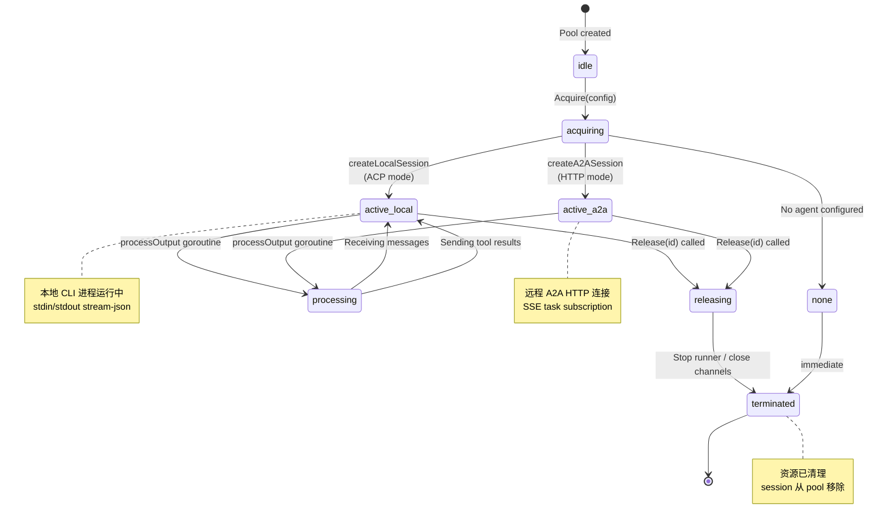
```mermaid
stateDiagram-v2
    [*] --> idle : Pool created

    idle --> acquiring : Acquire(config)

    acquiring --> active_local : createLocalSession<br/>(ACP mode)
    acquiring --> active_a2a : createA2ASession<br/>(HTTP mode)
    acquiring --> none : No agent configured

    active_local --> processing : processOutput goroutine
    active_a2a --> processing : processOutput goroutine

    processing --> active_local : Receiving messages
    processing --> active_local : Sending tool results

    active_local --> releasing : Release(id) called
    active_a2a --> releasing : Release(id) called

    releasing --> terminated : Stop runner / close channels
    none --> terminated : immediate

    terminated --> [*]

    note right of active_local
        本地 CLI 进程运行中
        stdin/stdout stream-json
    end note
    note right of active_a2a
        远程 A2A HTTP 连接
        SSE task subscription
    end note
    note right of terminated
        资源已清理
        session 从 pool 移除
    end note
```

---

## 11. 部署架构

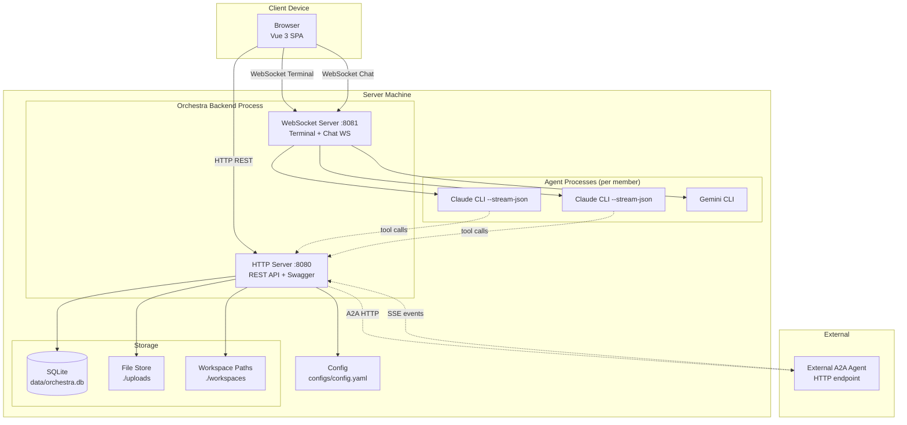
```mermaid
graph TB
    subgraph "Client Device"
        Browser[Browser<br/>Vue 3 SPA]
    end

    subgraph "Server Machine"
        subgraph "Orchestra Backend Process"
            HTTP[HTTP Server :8080<br/>REST API + Swagger]
            WSS[WebSocket Server :8081<br/>Terminal + Chat WS]
        end

        subgraph "Agent Processes (per member)"
            Claude1[Claude CLI --stream-json]
            Claude2[Claude CLI --stream-json]
            Gemini1[Gemini CLI]
        end

        subgraph "Storage"
            SQLite[(SQLite<br/>data/orchestra.db)]
            Uploads[File Store<br/>./uploads]
            Workspaces[Workspace Paths<br/>./workspaces]
        end

        Config[Config<br/>configs/config.yaml]
    end

    subgraph "External"
        A2A_Agent[External A2A Agent<br/>HTTP endpoint]
    end

    Browser -->|HTTP REST| HTTP
    Browser -->|WebSocket Terminal| WSS
    Browser -->|WebSocket Chat| WSS

    HTTP --> SQLite
    HTTP --> Uploads
    HTTP --> Workspaces
    HTTP --> Config

    WSS --> Claude1
    WSS --> Claude2
    WSS --> Gemini1

    Claude1 -.tool calls.-> HTTP
    Claude2 -.tool calls.-> HTTP

    HTTP -.A2A HTTP.-> A2A_Agent
    A2A_Agent -.SSE events.-> HTTP
```

---

## 12. 数据库 ER 图

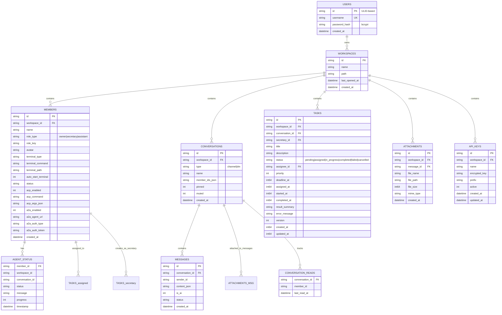
```mermaid
erDiagram
    USERS ||--o{ WORKSPACES : owns
    WORKSPACES ||--o{ MEMBERS : contains
    WORKSPACES ||--o{ CONVERSATIONS : contains
    WORKSPACES ||--o{ TASKS : contains
    WORKSPACES ||--o{ ATTACHMENTS : contains
    WORKSPACES ||--o{ API_KEYS : contains
    MEMBERS ||--o{ AGENT_STATUS : has
    MEMBERS ||--o{ TASKS_assigned : assigned_to
    MEMBERS ||--o{ TASKS_secretary : creates_as_secretary
    CONVERSATIONS ||--o{ MESSAGES : contains
    CONVERSATIONS ||--o{ ATTACHMENTS_MSG : attached_to_messages
    CONVERSATIONS ||--o{ CONVERSATION_READS : tracks

    USERS {
        string id PK "ULID-based"
        string username UK
        string password_hash "bcrypt"
        datetime created_at
    }

    WORKSPACES {
        string id PK
        string name
        string path
        datetime last_opened_at
        datetime created_at
    }

    MEMBERS {
        string id PK
        string workspace_id FK
        string name
        string role_type "owner|secretary|assistant"
        string role_key
        string avatar
        string terminal_type
        string terminal_command
        string terminal_path
        int auto_start_terminal
        string status
        int acp_enabled
        string acp_command
        string acp_args_json
        int a2a_enabled
        string a2a_agent_url
        string a2a_auth_type
        string a2a_auth_token
        datetime created_at
    }

    CONVERSATIONS {
        string id PK
        string workspace_id FK
        string type "channel|dm"
        string name
        string member_ids_json
        int pinned
        int muted
        datetime created_at
    }

    MESSAGES {
        string id PK
        string conversation_id FK
        string sender_id
        string content_json
        int is_ai
        string status
        datetime created_at
    }

    CONVERSATION_READS {
        string conversation_id FK
        string member_id
        datetime last_read_at
    }

    TASKS {
        string id PK
        string workspace_id FK
        string conversation_id FK
        string secretary_id FK
        string title
        string description
        string status "pending|assigned|in_progress|completed|failed|cancelled"
        string assignee_id FK
        int priority
        int64 deadline_at
        int64 assigned_at
        int64 started_at
        int64 completed_at
        string result_summary
        string error_message
        int version
        int64 created_at
        int64 updated_at
    }

    ATTACHMENTS {
        string id PK
        string workspace_id FK
        string message_id FK
        string file_name
        string file_path
        int64 file_size
        string mime_type
        datetime created_at
    }

    API_KEYS {
        string id PK
        string workspace_id FK
        string name
        string encrypted_key
        string prefix
        int active
        datetime created_at
        datetime updated_at
    }

    AGENT_STATUS {
        string member_id FK
        string workspace_id
        string conversation_id
        string status
        string message
        int progress
        datetime timestamp
    }
```

---

## 附录: 关键数据流

### A. 用户消息 → AI 回复 完整链路

```
User types message
  → Frontend: POST /api/workspaces/:id/conversations/:convId/messages
    → Backend: ConversationHandler.SendMessage()
      → MessageRepo.Create(isAI=false)
      → ChatHub.BroadcastToWorkspace(new_message)
        → All WebSocket clients receive push
    → Response to frontend: {success, message}

  [Message reaches Secretary agent via terminal session]
  → Secretary processes message
  → Secretary uses tools via A2A protocol:
    → LocalRunner receives tool_use from Claude stdout
    → Pool.processOutput detects ToolUse
    → ToolHandler.ExecuteTool() runs
    → Tool result sent back to Claude via LocalRunner.SendToolResult
    → Claude continues processing...
    → Claude outputs assistant_message
    → LocalRunner onOutput callback fires
    → Pool.processOutput → AgentBridge.OnMessage
    → AgentBridge creates chat message in DB
    → ChatHub.BroadcastToWorkspace(new_message)
      → All WebSocket clients receive AI response
```

### B. 任务分发链路

```
Secretary decides to delegate
  → Tool: orchestra_task_create {title, description, assigneeId}
    → ToolHandler.handleTaskCreate()
      → TaskRepo.Create(status=assigned)
      → dispatchTaskToAssignee(task) goroutine:
        → Pool.SessionForWorkspaceMember(assigneeId)
        → if no session: Pool.Acquire(member config)
        → LocalRunner.Start() → spawn Claude CLI
        → Session.SendUserMessage(prompt)
          → stdin: #conversationId{X}#taskId{Y}[秘书分配任务]: description

  Assistant receives task prompt
  → Tool: orchestra_task_start
    → TaskRepo.UpdateStatus(in_progress)
  → Assistant works...
  → Tool: orchestra_task_complete {resultSummary}
    → TaskRepo.UpdateStatus(completed)
  → Assistant reports result back to conversation
  → Secretary sees completion
```

---

*文档结束。此 UML 图集基于实际代码生成，可作为后续开发和重构的参考。*
