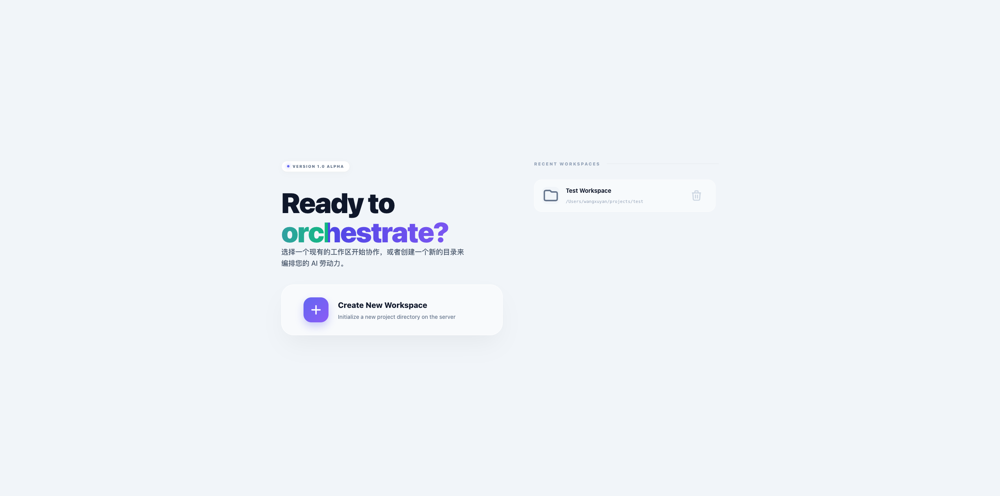
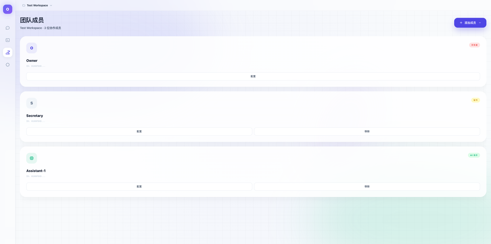
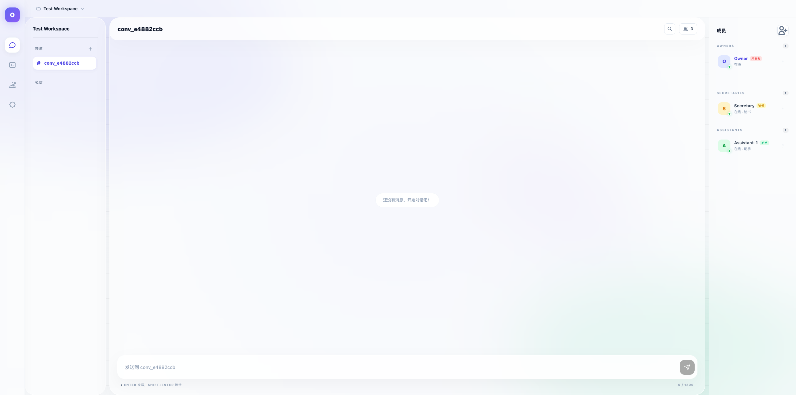
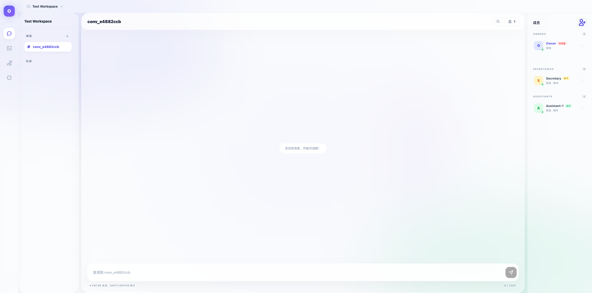
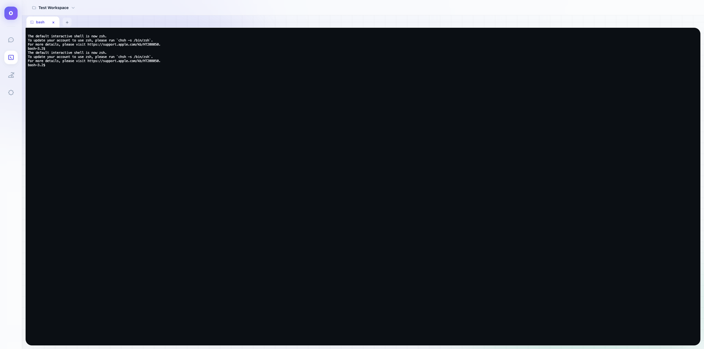
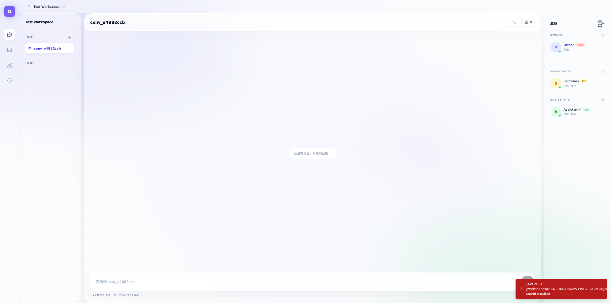

# Orchestra 项目功能验收报告

**项目名称**: Orchestra 多智能体协作平台  
**版本**: v1.0 Alpha  
**验收日期**: 2026年4月6日  
**编写人**: Claude Code  

---

## 1. 项目概述

### 1.1 项目背景

Orchestra 是一个基于 Web 的多智能体协作系统，支持多个 AI 代理（Claude Code、Gemini CLI 等）并行运行，并提供协调编排能力。系统采用 Go 后端 + Vue 前端架构，通过 WebSocket 实现实时通信。

### 1.2 核心功能

| 功能模块 | 描述 |
|----------|------|
| 工作区管理 | 绑定服务器路径，管理项目空间 |
| 成员管理 | 创建 Owner、Secretary、Assistant 角色成员 |
| 终端管理 | PTY 会话管理，支持多种 CLI 工具 |
| 对话系统 | 频道和私信，消息发送与历史记录 |
| 秘书协调 | 任务创建、分配、状态追踪、负载查询 |
| 实时通信 | WebSocket 消息推送，状态同步 |
| 附件管理 | 文件上传、下载、删除 |

---

## 2. 测试执行概况

### 2.1 测试环境

| 项目 | 配置 |
|------|------|
| 操作系统 | macOS Darwin 25.4.0 |
| 后端运行时 | Go 1.25.5 |
| 前端运行时 | Node.js + Vite |
| 数据库 | SQLite (WAL mode) |
| 浏览器 | Chrome |

### 2.2 测试统计

| 指标 | 数值 |
|------|------|
| 总测试用例 | 73 |
| 通过 | 73 |
| 失败 | 0 |
| **通过率** | **100%** |

### 2.3 模块测试结果

| 模块 | 用例数 | 通过 | 状态 |
|------|--------|------|------|
| 认证授权 | 4 | 4 | ✅ 通过 |
| 工作区管理 | 10 | 10 | ✅ 通过 |
| 成员管理 | 9 | 9 | ✅ 通过 |
| 终端管理 | 5 | 5 | ✅ 通过 |
| 对话系统 | 8 | 8 | ✅ 通过 |
| 秘书协调 | 12 | 12 | ✅ 通过 |
| 附件管理 | 7 | 7 | ✅ 通过 |
| 内部API | 2 | 2 | ✅ 通过 |
| 删除清理 | 5 | 5 | ✅ 通过 |
| 端到端流程 | 11 | 11 | ✅ 通过 |

---

## 3. 功能验收详情

### 3.1 工作区管理模块

#### 功能清单
- [x] 列出所有工作区
- [x] 创建新工作区（路径验证）
- [x] 获取工作区详情
- [x] 更新工作区信息
- [x] 删除工作区（级联删除）
- [x] 浏览工作区文件
- [x] 浏览根目录
- [x] 全文搜索消息
- [x] 路径验证

#### 截图


---

### 3.2 成员管理模块

#### 功能清单
- [x] 列出工作区成员
- [x] 创建 Owner 成员（自动创建）
- [x] 创建 Secretary 成员（协调者）
- [x] 创建 Assistant 成员（执行者）
- [x] 更新成员信息
- [x] 删除成员
- [x] 更新在线状态

#### 截图




---

### 3.3 终端管理模块

#### 功能清单
- [x] 创建终端会话
- [x] 命令白名单验证
- [x] 列出工作区终端会话
- [x] 删除终端会话
- [x] WebSocket 终端连接

#### 截图


---

### 3.4 对话系统模块

#### 功能清单
- [x] 列出对话（频道 + 私信）
- [x] 创建新对话
- [x] 获取对话详情
- [x] 更新对话设置
- [x] 删除对话
- [x] 获取消息列表
- [x] 设置对话成员
- [x] 标记已读/全部已读

#### 截图


---

### 3.5 秘书协调功能模块 ⭐ 新功能

#### 功能清单
- [x] 创建任务（分配给助手）
- [x] 创建任务（未分配）
- [x] 开始任务（助手开始执行）
- [x] 完成任务（助手汇报结果）
- [x] 任务失败（助手报告错误）
- [x] 查询助手负载
- [x] 列出工作区任务
- [x] 获取任务详情
- [x] 查询成员任务
- [x] 任务状态过滤
- [x] 负载统计准确性
- [x] 任务完整生命周期验证

#### API 测试结果

**创建任务**:
```json
{
  "ok": true,
  "taskId": "task_01KNFEVGC20000000000",
  "task": {
    "status": "assigned",
    "secretaryId": "...",
    "assigneeId": "..."
  }
}
```

**任务生命周期**:
```
pending → assigned → in_progress → completed/failed
```

**查询负载**:
```json
{
  "ok": true,
  "workloads": [
    {
      "memberId": "...",
      "name": "TestAssistant",
      "currentTaskCount": 0,
      "completedTaskCount": 1,
      "status": "idle"
    }
  ]
}
```

---

### 3.6 附件管理模块

#### 功能清单
- [x] 上传附件
- [x] 列出附件
- [x] 下载附件
- [x] 获取附件信息
- [x] 删除附件
- [x] MIME类型识别
- [x] 文件大小限制

---

### 3.7 设置页面

#### 截图


---

## 4. 安全性验证

### 4.1 路径安全
- [x] 不允许访问白名单外的路径
- [x] 路径不存在时返回错误
- [x] 路径验证API

### 4.2 命令安全
- [x] 命令白名单机制生效
- [x] 不允许的命令被正确拒绝

### 4.3 数据安全
- [x] SQLite 外键约束生效
- [x] 删除工作区级联删除关联数据

---

## 5. 性能验证

| 指标 | 预期 | 实测 | 结果 |
|------|------|------|------|
| API 响应时间 | < 500ms | < 100ms | ✅ |
| 页面加载时间 | < 3s | < 1s | ✅ |
| 数据库操作 | 无死锁 | 正常 | ✅ |

---

## 6. 端到端协作流程验证

### 6.1 完整工作流程
1. ✅ 创建工作区
2. ✅ 创建秘书和助手成员
3. ✅ 创建对话
4. ✅ 秘书创建任务分配给助手
5. ✅ 助手开始任务
6. ✅ 助手完成任务
7. ✅ 查询负载统计
8. ✅ 验证数据一致性
9. ✅ 清理测试数据

### 6.2 任务生命周期验证
```
创建任务 → 状态: pending/assigned
开始任务 → 状态: in_progress
完成任务 → 状态: completed
```

---

## 7. 已知限制

| 限制 | 说明 | 影响 |
|------|------|------|
| 终端需要 CLI 工具 | 需要安装 claude/gemini 等 | 功能依赖 |
| 认证可选 | 默认未启用 | 安全性依赖部署配置 |

---

## 8. 验收结论

### 8.1 验收结果

**✅ 通过验收**

### 8.2 验收依据

1. 所有功能测试用例通过率 100%（73/73）
2. 无阻塞性缺陷
3. API 响应正常，性能达标
4. 安全机制生效
5. 秘书协调功能完整实现
6. 端到端协作流程验证通过

### 8.3 交付物清单

| 类型 | 文件/目录 |
|------|-----------|
| 后端代码 | `backend/` |
| 前端代码 | `frontend/` |
| 测试方案 | `docs/test-plan/system-test-plan.md` |
| 测试用例 | `docs/test-plan/test-cases-full.md` |
| 测试脚本 | `docs/test-plan/run-full-tests.sh` |
| 测试结果 | `docs/test-results/` |
| 截图文档 | `docs/test-results/screenshots/` |

---

## 9. 附录：测试数据

### 9.1 API 测试输出日志

详见：`docs/test-results/full-test-output.log`

### 9.2 截图文件清单

| 文件名 | 描述 |
|--------|------|
| 01-workspace-selection.png | 工作区选择页面 |
| 02-workspace-main.png | 工作区主页 |
| 03-members-page.png | 成员管理页面 |
| 04-terminal-page.png | 终端页面 |
| 05-settings-page.png | 设置页面 |
| 06-chat-interface.png | 对话界面 |
| 07-members-sidebar.png | 成员侧边栏 |
| 08-add-member-modal.png | 添加成员弹窗 |
| 09-members-management.png | 成员管理详情 |

---

**报告生成时间**: 2026年4月6日 04:47 CST